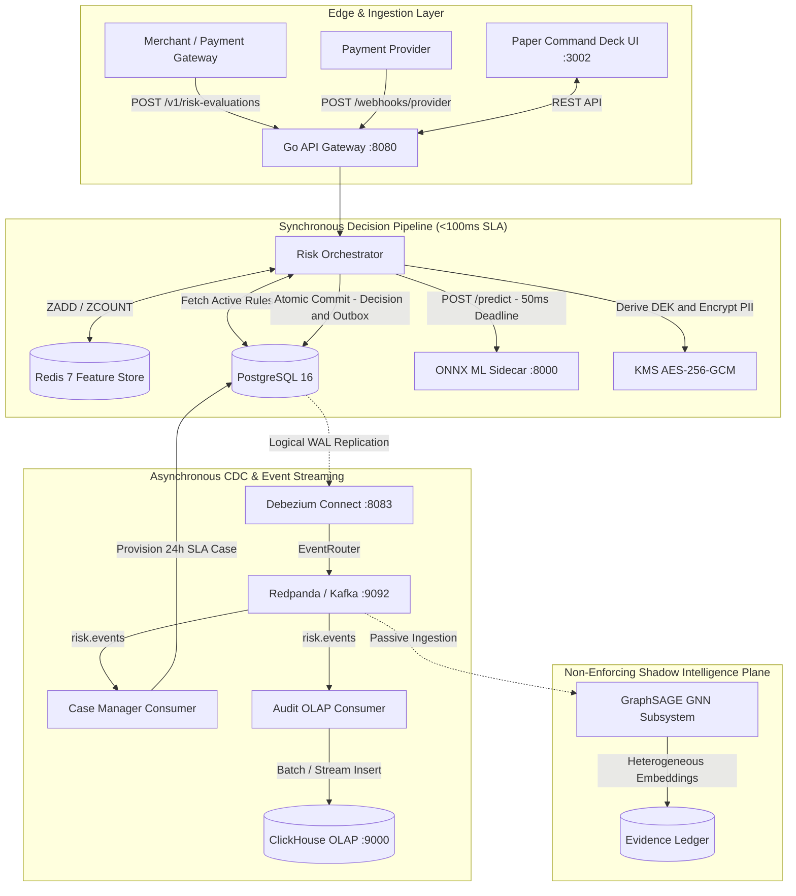

# ROPUS — AI Risk Manager 🛡️

[](https://go.dev/)
[](https://tanstack.com/)
[](https://www.postgresql.org/)
[](https://redis.io/)
[](https://onnxruntime.ai/)
[](https://redpanda.com/)
[](https://clickhouse.com/)
[](LICENSE)

ROPUS is an enterprise-grade, real-time **Payments Fraud, Abuse, and Chargeback Defense Platform**. Built with **Go** (High-Performance Decision Engine), **TanStack Start / React** (Paper Command Deck Control Plane), **Python / PyTorch / ONNX** (Statistical Calibration & Graph Intelligence), **PostgreSQL 16**, **Redis 7**, **Redpanda (Kafka)**, **Debezium CDC**, and **ClickHouse OLAP**.

The platform orchestrates multi-stage synchronous fraud decisioning (**<100ms p95 SLA**), deterministic JSON-AST rules with **Maker-Checker dual-control**, Bayes Minimum Risk (BMR) cost-optimal thresholding, inductive **GraphSAGE GNN relationship intelligence in non-enforcing shadow mode**, asynchronous **24-hour SLA analyst review queues**, **AES-256-GCM Envelope Encryption & Crypto-Shredding**, and cryptographic SHA-256 hash-chain auditing.

---

## 🏛️ System Architecture



---

## ⚡ Key Engineering Highlights & Governance Guarantees

### 1. Synchronous Multi-Stage Decision Pipeline (`<100ms SLA`)
* **Context Aggregation:** Queries real-time sliding-window counters (`velocity.ip.1hr`, `velocity.token.24hr`) from Redis Sorted Sets in `<5ms`.
* **Pre-Rules (Hard Guardrails):** Evaluates deterministic JSON-AST rules in `<0.4ms`. If a hard `DECLINE` or `ALLOW` rule triggers, pipeline evaluation halts immediately to conserve compute.
* **ONNX Runtime ML Serving (50ms Deadline):** Sub-millisecond fraud scoring sidecar running compiled XGBoost graphs with **local SHAP feature attributions**. If the ML sidecar times out or errors, Go gracefully degrades (`is_degraded: true`) to conservative heuristic rules without dropping customer transactions.
* **Bayes Minimum Risk (BMR) Cost-Optimal Decisioning:** Calibrated posterior probabilities $P(\text{fraud} \mid x)$ are mapped to dollar-denominated loss matrices ($\text{Cost}(\text{False Positive}) = \text{₹40,000} / \$500$).

### 2. GraphSAGE Inductive Relationship Intelligence (Shadow Mode — Governance Invariant)
* **Inductive Heterogeneous GNN:** Computes 64-dimensional node representations across 6 entity types (Customer, Device, IP, Card, Merchant, Payout Account) to detect synthetic identity rings and employee collusion.
* **0% Customer Decision Authority:** Operates in **strictly non-enforcing shadow mode**. Customer transaction routing is **100% determined by Baseline Dynamic BMR**.
* **Strict Promotion Gate:** GraphSAGE promotion to live decisioning is strictly blocked until $\ge 50$ confirmed real collusion cases accumulate past the 90-day dispute window and receive Model Risk Committee sign-off.
* **Cryptographic Checksum Immutability:**
  - Active Production Champion: `ml-service/model/candidates/production_model_v8_bmr.joblib` (`d473d1ef0c50f232b376c408be37e34c68a258df224277ee1357396e4e627cd7`)
  - Frozen Real Fraud Holdout: `ml-service/data/sample_ieee_fixture.csv` (`a30a387ad0fa8743599d6043120be6bd66ac17184b8eee4fb9ce764970201d44`)

### 3. Declarative JSON-AST Rules Engine & Maker-Checker Dual Control
* Zero arbitrary dynamic code execution (`eval()` is strictly prohibited). The Go AST interpreter evaluates nested boolean trees (`AND`, `OR`, `NOT`) and comparison predicates.
* **Dual-Control Governance:** State machine (`DRAFT` $\rightarrow$ `PENDING_APPROVAL` $\rightarrow$ `ACTIVE`) enforces that a rule creator cannot approve their own rule (`ErrMakerCheckerViolation` / HTTP 403).

### 4. Transactional Outbox Pattern & Zero Message Loss
* Employs PostgreSQL ACID transactions (`pgx.Tx`) committing `risk_decisions` and `outbox_events` atomically.
* Background CDC / Outbox flushers guarantee exactly-once event streaming even during network partitions.

### 5. Cryptographic SHA-256 Hash-Chain Audit Ledger
* Every decision and analyst case disposition is immutably linked in a tamper-evident cryptographic hash chain:
  $$H_i = \text{SHA-256}(H_{i-1} \parallel \text{EntryID} \parallel \text{Timestamp} \parallel \text{PayloadHash})$$

---

## 🚀 Quickstart & Local Development

### Prerequisites
* [Docker Desktop](https://www.docker.com/) (v24.0+) & Docker Compose
* [Go 1.22+](https://go.dev/)
* [Node.js 20+](https://nodejs.org/) or [Bun](https://bun.sh/)
* [Python 3.11+](https://www.python.org/)

### 1. Launch Docker Infrastructure
```bash
# Clone the repository
git clone https://github.com/shankywho/ropus.git
cd ropus

# Copy environment variables
cp .env.example .env

# Launch core infrastructure (PostgreSQL, Redis, ClickHouse, Redpanda)
docker compose up -d postgres redis clickhouse redpanda
```

### 2. Start Go Decision Engine
```bash
cd backend
go run cmd/api/main.go
# Listens on http://localhost:8080
```

### 3. Start Python ML Sidecar
```bash
cd ml-service
python3 -m venv .venv
source .venv/bin/activate
pip install -r requirements.txt
python3 serve.py
# Listens on http://localhost:8000
```

### 4. Start Frontend Control Plane
```bash
cd frontend
bun install # or npm install
bun run dev # or npm run dev
# Listens on http://localhost:3002
```

---

## 🌐 Control Plane Navigation

| Route | View | Description |
|---|---|---|
| **`/`** | Overview & Signal Thesis | Real-time system health, multi-signal decomposition, and incident summary |
| **`/demo`** | 7-Stage Incident Replay | Deterministic 7-stage attack lifecycle replay and live chaos failure toggles |
| **`/graph`** | Fraud Knowledge Graph | Interactive multi-hop entity graph traversal and mule ring exploration |
| **`/models`** | Model Registry | Active BMR Champion vs GraphSAGE Shadow candidate tracking, drift PSI, and latency |
| **`/rules`** | Rules Engine | JSON-AST policy rule editor with Maker-Checker dual control |
| **`/cases`** | Case Management | Analyst queue with 24-hour SLA countdowns and forensic evidence dossiers |
| **`/decisions`** | Decision Explorer | Real-time score attribution, factor decomposition, and raw payload audit |
| **`/operations`** | Operations & SLOs | P99 latency tracking, error budgets, canary controls, and incident logs |
| **`/security`** | Cryptographic Audit | SHA-256 hash-chain verification and tamper-detection inspector |

---

## 🧪 Testing & Verification

Run the Go platform test suite:
```bash
cd backend
go test -v ./...
```

Run Python ML & GraphSAGE verification tests:
```bash
cd ml-service
pytest tests/ -v
```

Verify Frontend build:
```bash
cd frontend
bun run build # or npm run build
```

Verify Cryptographic Checksums:
```bash
shasum -a 256 ml-service/model/candidates/production_model_v8_bmr.joblib ml-service/data/sample_ieee_fixture.csv
```

---

## 🛡️ Defense-Only Threat Model & Safety Boundaries

Per regulatory safety mandates, the system enforces strict physical and architectural boundaries against misuse:
* **Zero Execution Authority:** Emits risk recommendations only (`ALLOW`, `MANUAL_REVIEW`, `DECLINE`). Contains zero direct integration with payment rails or autonomous fund movement.
* **Anti-Probing & Oracle Defense:** Detailed feature attributions and SHAP reason codes are exposed exclusively to authenticated analyst sessions and backend webhooks, preventing attackers from reverse-engineering thresholds.
* **Conservative Fail-Safe Degradation:** If downstream models or feature stores become unavailable, the engine degrades into deterministic pre-rules—never a lenient fail-open path.
* **AST Sandbox:** Rules execute inside a closed Go AST interpreter with zero dynamic `eval()` capability.

---

## 📄 License
This project is licensed under the MIT License — see the [LICENSE](LICENSE) file for details.
