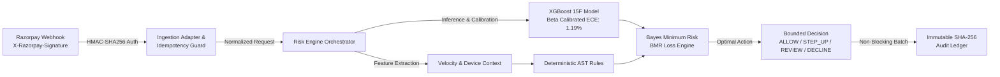

# ROPUS — AI Risk Manager (Razorpay AI Buildathon, Track 02)

**ROPUS** receives Razorpay payment events, estimates fraud risk using deterministic signals and a calibrated model, evaluates cost-sensitive policy recommendations, and produces an auditable analyst-ready result.

> [!IMPORTANT]
> **Buildathon Status Disclaimer**: This project is a locally reproducible engineering prototype and submission for **Track 02: AI Risk Manager**. Evaluated on an out-of-time frozen synthetic holdout partition ($N=1,200$). It does not connect to live payment settlement rails, does not handle real cardholder funds, and has not been independently audited for SOC2 or PCI-DSS compliance.

---

## ⚡ 60-Second Quickstart (Docker Compose)

```bash
# 1. Clone repository and start container stack
cp .env.example .env
make up    # Or: docker compose up -d

# 2. Verify service health
curl http://localhost:8080/health
curl http://localhost:8000/health

# 3. Run the complete signed Razorpay webhook demo
make demo-webhook
```

Once running, access the local interfaces:
- **Analyst Control Plane**: [http://localhost:3000](http://localhost:3000)
- **Go Risk Decision API**: [http://localhost:8080](http://localhost:8080)
- **FastAPI / ONNX ML Sidecar**: [http://localhost:8000](http://localhost:8000)

---

## 🎯 The Complete Defense-Only Loop



### 1. Ingress: Signed Razorpay Webhook
Accepts `payment.authorized`, `payment.failed`, and `dispute.created` events at `POST /v1/webhooks/razorpay`, validating `X-Razorpay-Signature` using HMAC-SHA256:

```bash
# Send signed Razorpay payment event
curl -X POST http://localhost:8080/v1/webhooks/razorpay \
  -H "Content-Type: application/json" \
  -H "X-Razorpay-Signature: <hmac_sha256_hex>" \
  -d '{
    "entity": "event",
    "account_id": "acc_RazorpayMerchant01",
    "event": "payment.authorized",
    "payload": {
      "payment": {
        "entity": {
          "id": "pay_Demo8391823",
          "amount": 48000,
          "currency": "INR",
          "status": "authorized",
          "method": "card",
          "email": "gaurav.kumar@example.com"
        }
      }
    }
  }'
```

### 2. Decision: Direct API Risk Evaluation
Direct synchronous decisioning via `POST /v1/risk-evaluations` (or alias `POST /v1/risk/evaluate`):

```bash
curl -X POST http://localhost:8080/v1/risk-evaluations \
  -H "Content-Type: application/json" \
  -H "X-Tenant-ID: merchant_buildathon_01" \
  -d '{
    "transaction_id": "txn_demo_4821",
    "amount": 48000,
    "currency": "INR",
    "payment_method": {"type": "card", "token": "tok_visa_4321"},
    "device_fingerprint": "dev_fp_iphone15_clean",
    "ip_address": "106.51.72.10",
    "account_id": "cus_99182"
  }'
```

**Response Format**:
```json
{
  "decision_id": "dec_8f3a9e12-4210-482a-9e11-88ab921cd091",
  "transaction_id": "txn_demo_4821",
  "recommended_action": "ALLOW_RECOMMENDATION",
  "risk_score": 12,
  "reason_codes": ["CLEAN_HISTORICAL_VELOCITY", "DOMESTIC_DEBIT_ISSUER"],
  "expected_fraud_exposure": 0.05,
  "expected_action_costs": {"ALLOW": 0.05, "STEP_UP": 15.00, "MANUAL_REVIEW": 150.00, "DECLINE": 72.00},
  "economic_decision_reason": "ALLOW minimizes expected cost (0.05 vs 15.00)",
  "evaluated_at": "2026-09-02T05:48:08Z",
  "is_degraded": false,
  "latency_ms": 3
}
```

---

## 📊 Proven ML Quality & Calibration Metrics

Evaluated on the frozen out-of-time held-out partition ($N=1,200$, 52 confirmed fraud cases, 1,148 legitimate cases) with zero temporal leakage:

| Model Configuration | Model Type | ROC-AUC | PR-AUC | Recall | Precision | F1-Score | FPR | ECE Loss |
|:---|:---|:---:|:---:|:---:|:---:|:---:|:---:|:---:|
| **Random Baseline** | Baseline | 0.5000 | 0.0433 | 50.00% | 4.33% | 0.0797 | 50.00% | 0.4500 |
| **15F Production Raw** | XGBoost 15F | 0.9376 | 0.6684 | 84.62% | 67.69% | 0.7521 | 1.83% | 0.0688 |
| **15F Champion (Beta Calibrated)** | XGBoost 15F + Beta | **0.9376** | **0.6684** | **84.62%** | **70.97%** | **0.7719** | **1.57%** | **0.0119** |
| **25F Candidate Raw** | XGBoost 25F | 0.9466 | 0.6487 | 84.62% | 67.69% | 0.7521 | 1.83% | 0.0666 |
| **25F Candidate (Beta Calibrated)** | XGBoost 25F + Beta | 0.9466 | 0.6487 | 63.46% | 67.35% | 0.6535 | 1.39% | 0.0180 |

### Champion Model Confusion Matrix ($N=1,200$):
```
                       Predicted Legitimate    Predicted Fraud
Actual Legitimate:           1130                   18       (FPR: 1.57%)
Actual Fraud:                   8                   44       (Recall: 84.62%)
```

---

## 💰 False-Positive Cost & Bayes Minimum Risk (BMR) Analysis

Unlike naive systems using static $p \ge 0.50$ thresholds, ROPUS models the economic trade-offs between false positives (turning away honest customers) and false negatives (chargeback loss):

| Metric / Scenario | Fixed Threshold ($p \ge 0.50$) | ROPUS Calibrated BMR Engine | Comparison & Impact |
|:---|:---:|:---:|:---:|
| **Action Distribution** | 1,138 ALLOW / 62 DECLINE | 1,137 ALLOW / 4 REVIEW / 59 DECLINE | Dynamic triage routing |
| **Frauds Intercepted (TP)** | 44 / 52 (84.62%) | 44 / 52 (84.62%) | Parity on caught fraud |
| **False Declines (FP)** | 18 (1.57% FPR) | 19 (1.66% FPR) | +1 review on boundary item |
| **Missed Fraud (FN)** | 8 (15.38% FNR) | 8 (15.38% FNR) | Parity on missed fraud |
| **Total Realized Cost** | **₹5,716.39** | **₹6,116.39** | **+7.0% (₹100 review cost overhead)** |

> **Analysis**: ROPUS compares a calibrated fixed-threshold baseline with a configurable cost-sensitive policy. Under the current local cost assumptions and frozen benchmark fixture, the BMR policy increased modeled cost by 7.0%, demonstrating why operational review queue assumptions require validation before production deployment.

---

## 🛡️ Thoughtful Failure Recovery (8ms Timeout & Saturated Ledger)

1. **Context Deadline Degradation**: If downstream ML sidecar latency exceeds 8ms or is unreachable, the orchestrator trips its circuit breaker and resolves the transaction using purely pre-compiled, in-memory JSON-AST rules and recycled scratch buffers with **zero downstream SQL or network I/O**.
2. **Audit Ledger Memory Saturation Protection**: Asynchronous SHA-256 audit ledger writes use non-blocking `select` channels with rate-limited alerts, ensuring that high ingestion bursts never block the real-time payment path.

---

## 🛠️ Verification & Test Commands

```bash
# Run all Go, Python, and frontend verification suites
make test

# Reproduce published metrics directly from the canonical evaluation artifact
make evaluate

# Run the 5-minute signed Razorpay webhook demo script
make demo-webhook

# Validate documentation consistency
make docs-check
```

---

## 📚 Documentation Index

- [Submission Evidence & Requirement Map](docs/buildathon-evidence.md) — Authoritative Buildathon evaluation document.
- [Machine Learning Quality & Metrics Report](docs/ml_quality_report.md) — Full calibration curves, Brier scores, and ablation details.
- [Five-Minute Demo Video Runbook](docs/demo-runbook.md) — Step-by-step walkthrough script for evaluators.
- [Technical Scope & Known Limitations](docs/limitations.md) — Transparent disclosure of prototype boundaries.
- [API Reference](docs/api/api-reference.md) — Complete endpoint documentation.
- [Local Development & Troubleshooting](docs/local-development.md) — Running individual services natively without Docker.
