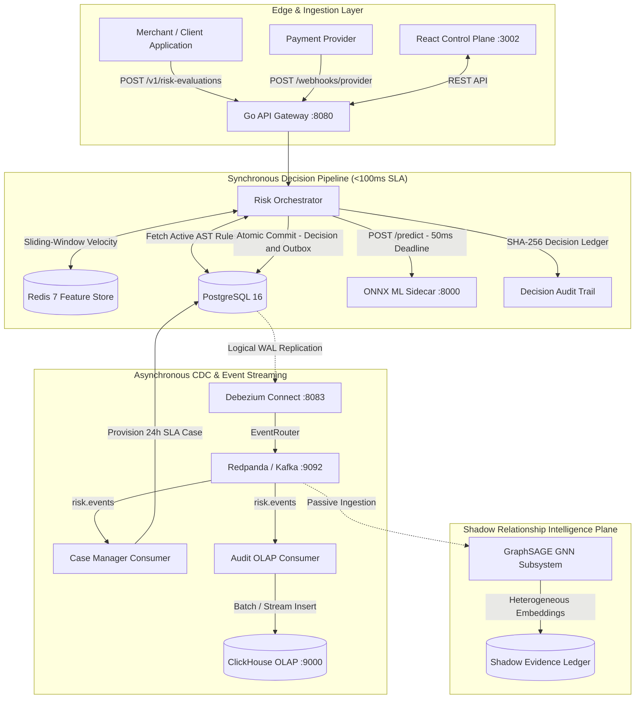

# ROPUS — AI Risk Manager 🛡️

Most fraud detection systems reduce risk decisioning to an arbitrary score threshold, ignoring transaction economics. **ROPUS** combines real-time streaming feature extraction with **Bayes Minimum Risk (BMR)** cost-optimal decisioning—evaluating calibrated posterior probabilities against dynamic loss matrices to choose the action that minimizes expected financial loss. The platform processes synchronous risk evaluations with deterministic Go AST guardrails, Redis velocity counters, and an in-memory entity graph before committing decisions through a transactional outbox.

---

## 🏛️ System Architecture



---

## ⚡ Core Engineering Highlights (Live-Verifiable End-to-End)

### 1. Server-Side Maker-Checker Rule Governance (403 on Self-Approval)
Policy rules are evaluated via a sandboxed Go JSON-AST interpreter with zero dynamic `eval()`. Transitions through the lifecycle (`DRAFT` $\rightarrow$ `PENDING_APPROVAL` $\rightarrow$ `ACTIVE`) strictly require two distinct principals:
```bash
# Attempting to approve your own rule returns HTTP 403 Forbidden
curl -X PUT http://localhost:8080/v1/rules/rule_123/status \
  -H "X-Actor-ID: rule_creator_alice" \
  -d '{"status": "ACTIVE"}'
# Response: 403 Forbidden ("rule creator cannot approve their own rule")
```

### 2. Live `/demo` Control Plane
The web UI command deck does not fake state transitions client-side. Triggering attack scenarios or adjusting canary rollout percentages sends real HTTP mutations (`POST /v1/risk-evaluations`, `POST /v1/canary/control`) to the Go engine, persisting decisions into PostgreSQL and feature counters into Redis.

### 3. Bayes Minimum Risk (BMR) Cost-Optimal Decisioning
Instead of static cutoff scores, decisions are calculated by evaluating calibrated probability $P(\text{fraud} \mid x)$ against dollar-denominated loss functions:
$$\text{Expected Loss}(\text{ALLOW}) = P(\text{fraud} \mid x) \times (\text{Amount} \times 1.05)$$
$$\text{Expected Loss}(\text{DECLINE}) = (1 - P(\text{fraud} \mid x)) \times \text{Cost}(\text{False Positive})$$
The system dynamically selects the action ($\text{ALLOW}$, $\text{MANUAL\_REVIEW}$, $\text{DECLINE}$) that minimizes total expected cost.

### 4. Cryptographic SHA-256 Decision Audit Chain
Every evaluated decision and policy modification is linked into a sequential SHA-256 cryptographic hash chain:
$$H_i = \text{SHA-256}(H_{i-1} \parallel \text{EntryID} \parallel \text{Timestamp} \parallel \text{PayloadHash})$$
Live chain integrity can be verified at any time:
```bash
curl http://localhost:8080/v1/audit/verify
# Response: {"status":"PASS","integrity_verified":true,"total_decisions_audited":42,"head_hash":"..."}
```

---

## 🔬 Subsystem Deep Dives

### Inductive Graph Intelligence (Shadow Mode)
An inductive GraphSAGE GNN evaluates 6-entity heterogeneous relationships (Customer, Device, IP, Card, Merchant, Payout Account) to detect multi-account mule clusters. The graph engine runs process-locally with tenant namespacing (`<tenant_id>:<entity_type>:<raw_id>`) for sub-millisecond traversal and operates in shadow mode alongside the primary BMR decisioning pipeline.

### Durable Multi-Layer Idempotency & Fault Resilience
- **Multi-Layer Idempotency:** Layer-1 in-memory mutex coalescing (<0.02ms) backed by Layer-2 PostgreSQL uniqueness on `(tenant_id, idempotency_key)` with SHA-256 payload tampering detection. Active leases are renewed via a 2-second heartbeat ticker; crashed pod leases (>10s) are safely reclaimed on retry.
- **Dependency Circuit Breakers:** 3-state circuit breakers protect Redis, PostgreSQL, and ML dependencies. If a downstream service fails $N$ times, the breaker trips to `OPEN`, immediately routing requests through fast-fail heuristic fallback rules. Live drills can be executed via `POST /v1/chaos/drill`.
- **Transactional Outbox:** PostgreSQL ACID transactions commit `risk_decisions` and `outbox_events` atomically, ensuring at-least-once streaming delivery to Redpanda/Kafka without dual-write inconsistency.

---

## 🛠️ Technology Stack

[](https://go.dev/)
[](https://tanstack.com/)
[](https://www.postgresql.org/)
[](https://redis.io/)
[](https://onnxruntime.ai/)
[](https://redpanda.com/)
[](https://clickhouse.com/)
[](LICENSE)

---

## 🚀 Quickstart & Local Development

### Prerequisites
* [Docker Desktop](https://www.docker.com/) (v24.0+) & Docker Compose
* [Go 1.22+](https://go.dev/)
* [Node.js 20+](https://nodejs.org/) or [Bun](https://bun.sh/)
* [Python 3.11+](https://www.python.org/)

### 1. Launch Docker Infrastructure
```bash
# Clone the repository
git clone https://github.com/shankywho/ropus.git
cd ropus

# Copy environment configuration
cp .env.example .env

# Launch core data infrastructure
docker compose up -d postgres redis clickhouse redpanda
```

### 2. Start Go Decision Engine
```bash
cd backend
go run cmd/api/main.go
# Listens on http://localhost:8080
```

### 3. Start Python ML Sidecar
```bash
cd ml-service
python3 -m venv .venv
source .venv/bin/activate
pip install -r requirements.txt
python3 serve.py
# Listens on http://localhost:8000
```

### 4. Start Frontend Control Plane
```bash
cd frontend
bun install # or npm install
bun run dev # or npm run dev
# Listens on http://localhost:3002
```

---

## 🌐 Control Plane Navigation

| Route | View | Description |
|---|---|---|
| **`/`** | Overview & Metrics | Real-time system health, decision distribution, and throughput metrics |
| **`/demo`** | Interactive Demo | End-to-end scenario dispatcher and live chaos failure injection |
| **`/graph`** | Entity Graph Explorer | In-memory 3-hop relationship graph and cluster exploration |
| **`/models`** | Model Registry | ONNX model versioning, feature contracts, and canary distribution |
| **`/rules`** | Rules Engine | JSON-AST policy rule editor with Maker-Checker dual control |
| **`/cases`** | Case Management | Analyst queue with forensic evidence dossiers and disposition tracking |
| **`/decisions`** | Decision Explorer | Real-time score attribution, factor decomposition, and raw payload audit |
| **`/operations`** | Operations & SLOs | P99 latency tracking, error budgets, canary controls, and incident logs |
| **`/security`** | Cryptographic Audit | SHA-256 decision audit chain verification and tamper detection |

---

## 🧪 Testing & Verification

Run the full Go test suite:
```bash
cd backend
go test -v ./...
```

Run Python ML & calibration tests:
```bash
cd ml-service
pytest tests/ -q
```

Build the Frontend production bundle:
```bash
cd frontend
npm run build
```

---

## 🛡️ Safety Boundaries

* **Recommendation-Only Execution:** The engine outputs structured decisions (`ALLOW`, `MANUAL_REVIEW`, `DECLINE`) without direct payment rail access or autonomous fund settlement.
* **Anti-Probing Defense:** Detailed SHAP factor weights are restricted to authenticated analyst endpoints and webhook payloads to prevent oracle boundary mapping.
* **Fail-Safe Fallback:** If ML sidecars or Redis stores become unreachable, the engine degrades gracefully to deterministic AST rules rather than failing open.

---

## 📄 License
This project is licensed under the MIT License — see the [LICENSE](LICENSE) file for details.
