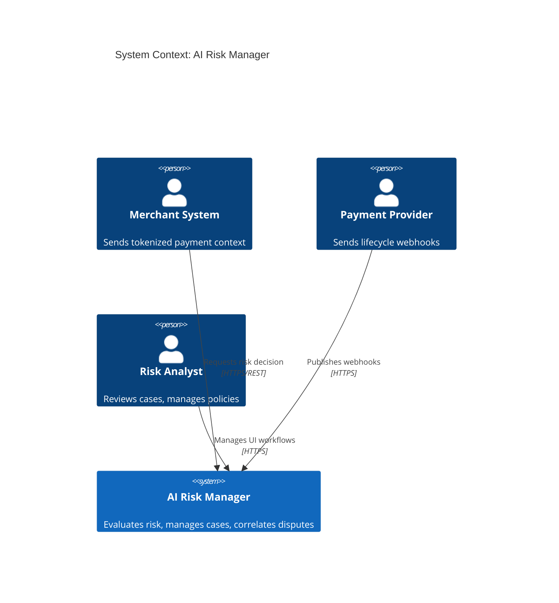
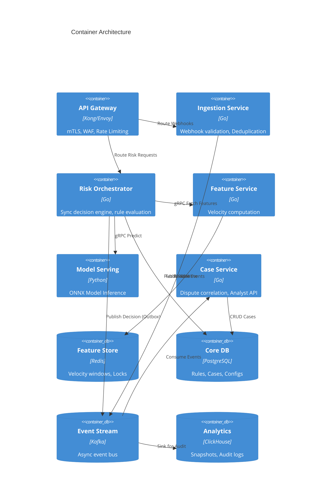
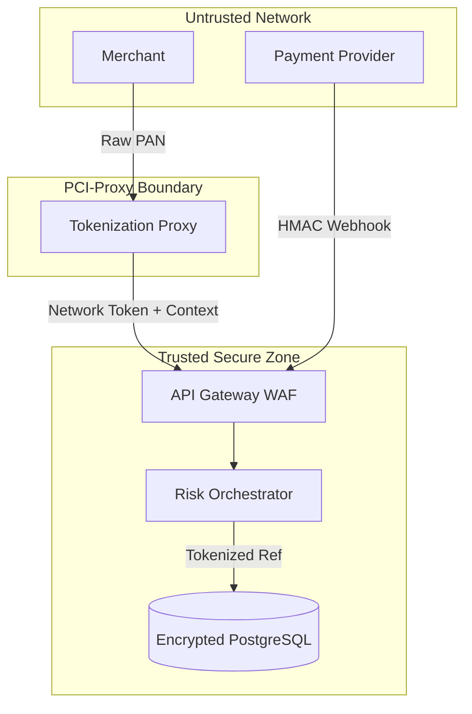
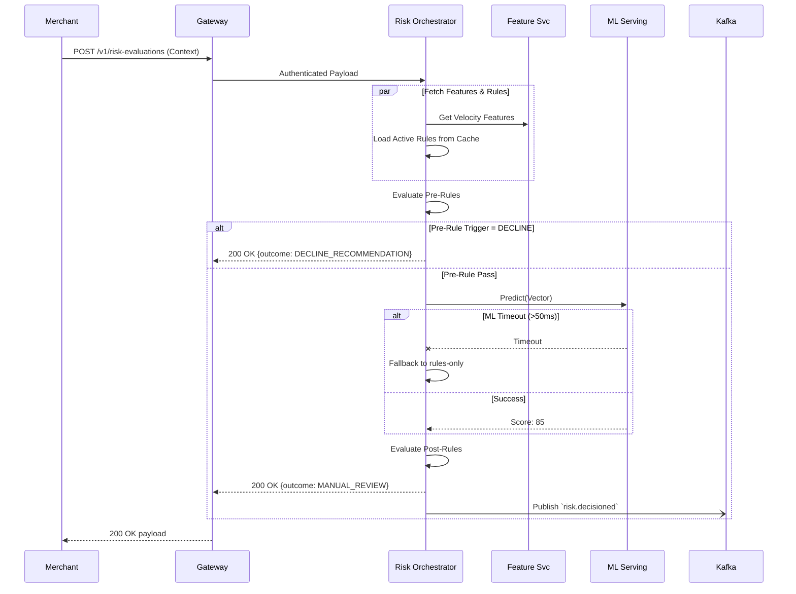

# AI Risk Manager
## Backend Architecture and Delivery Plan
### Real-Time Payments Fraud, Dispute, and Chargeback Defense Platform

**Document Control**
- Document Title: AI Risk Manager Backend Architecture and Delivery Plan
- Version: 1.0
- Date: August 20, 2026
- Intended Audience: Engineering Leadership, SRE, Security, Product, and Compliance Teams
- Classification: Internal Engineering / Confidential Planning

## Table of Contents
1. Architecture Review of the Existing Draft
2. Hard Scope Boundaries
3. Required Product Capabilities
4. Production Architecture Requirements
5. Architecture Diagrams
6. API, Schema, and Data Model Deliverables
7. Reliability, Security, and Operations Requirements
8. Testing and Quality Plan
9. Phased Execution Plan & Backlog
10. Open Questions Requiring Professional Review
11. Glossary & References

---

## 1. Architecture Review of the Existing Draft

The initial architecture draft was evaluated for production readiness. Below is the critical audit:

- **Claims of "exactly-once" processing in Kafka (Technically inaccurate or overstated):** Kafka provides transport-level guarantees via transactional producers/consumers, but this does not guarantee exactly-once business effects. The platform implements database unique constraints (`event_id`), the Outbox pattern for publishing events from the primary relational database, and idempotent consumer logic.
- **PAN/Luhn regex as a PCI control (Risky assumption):** Pattern matching is a secondary Data Loss Prevention (DLP) control, not a primary boundary. The primary control must be network-level tokenization via a PCI-validated proxy before the application edge.
- **Tokenized payment reference eliminates PCI obligations (Risky assumption):** Tokenization reduces audit scope by preventing systems from handling raw sensitive data, but it does not eliminate all PCI DSS v4.0.1 obligations. Eligibility criteria still require confirming the site and backend are isolated from e-commerce risk vectors.
- **"API key JWT authentication" (Needs clarification):** API keys (long-lived, static) are distinct from JWTs (short-lived, scoped access tokens). The platform distinguishes between merchant API keys (server-to-server integration), user OAuth/JWTs (analyst UI), and workload identity (mTLS) for internal service communication.
- **Merchant-configurable fail-open/fail-closed behavior (Risky assumption):** Uncontrolled fail-open exposes payment infrastructure to massive fraud liability. Fail-open thresholds must be bounded by platform guardrails and tiered based on merchant risk profiles.
- **Redis-backed velocity features (Missing production requirement):** The draft lacked handling for race conditions, out-of-order events, and eviction policies. A strategy for asynchronous feature rebuilds from the immutable event stream is mandatory.
- **Crypto-shredding and personal-data deletion (Compliance/legal item requiring specialist validation):** While the DPDP Act 2023 grants data principals the right to erasure, financial retention regulations (e.g., RBI mandates) impose overriding 10-year retention duties. A formal data-classification and retention-policy framework is required.
- **Returning HTTP 403 or 201 for risk outcomes (Technically inaccurate or overstated):** HTTP transport status codes must represent protocol state, not business logic. A risk decision is returned via a 200 OK containing a structured JSON business payload.
- **Synchronous latency target <50ms (Missing production requirement):** A 50ms p95 budget for network ingress, DB read, cache fetch, rule evaluation, ML inference, and DB write is unrealistic. The architecture separates synchronous work (Rule evaluation + Cache reads = <100ms) from asynchronous audit writes and analytical data shipping.
- **Multi-tenancy (Needs clarification):** Row-Level Security (RLS) in PostgreSQL is insufficient alone. Isolation extends to Redis cache keys (namespacing), Kafka topic partitioning, and strictly segregated encryption keys per tenant.
- **Security of rules and policy changes (Missing production requirement):** Rule modifications require dual-control (maker-checker), segregation of duties, shadow-mode validation, and emergency kill switches to prevent autonomous, untested fraud blocks.
- **ML-risk decisions (Missing production requirement):** ML architecture accounts for label delay (chargebacks arrive 30-90 days post-transaction), training-serving skew, and adversarial drift. LLMs are restricted from authoritative decision paths and used only for internal, RAG-bounded analyst assistance.
- **India-specific compliance assumptions (Compliance/legal item requiring specialist validation):** The RBI directive on Storage of Payment System Data strictly mandates that end-to-end payment transaction data must be stored exclusively within India (`ap-south-1`).

---

## 2. Hard Scope Boundaries

This platform is a risk decisioning, case-management, and evidence platform. It acts as an intelligence layer augmenting a payment processor.

**The System WILL:**
- Receive normalized, tokenized merchant events and authorized provider webhooks.
- Calculate risk signals and return decision recommendations.
- Create and manage manual-review cases for analysts.
- Correlate dispute webhooks with historical transaction evidence.
- Provide robust, immutable audit trails of all policy and decision changes.

**The System WILL NOT:**
- Store raw Primary Account Numbers (PAN), CVV, PIN, or Track data.
- Move money, settle funds, or act as the financial ledger of record.
- Autonomously submit chargeback representments or issue refunds without an explicit human or authorized downstream trigger.
- Put an LLM in the real-time allow/decline decision path.
- Host or render frontend UI screens.

---

## 3. Required Product Capabilities

### 3.1 Real-Time Risk Decisioning
- **Synchronous Evaluation:** Exposes a low-latency API (`/v1/risk-evaluations`) returning a strict JSON contract.
- **Supported Outcomes:** `ALLOW_RECOMMENDATION`, `STEP_UP_RECOMMENDATION` (e.g., trigger 3DS), `MANUAL_REVIEW` (routes to queue, but allows auth), `HOLD_RECOMMENDATION` (auth, but delay capture), `DECLINE_RECOMMENDATION`, `SHADOW_ONLY`, `INSUFFICIENT_CONTEXT`.
- **Contract Guarantees:** Outcomes are recommendations; the payment network ultimately authorizes the transaction.

### 3.2 Event and Webhook Ingestion
The system ingests 16 distinct event types (e.g., `payment.attempted`, `dispute.opened`).
- **Identity & Validation:** Webhooks must pass HMAC-SHA256 signature verification.
- **Idempotency:** Enforced via `Idempotency-Key` headers backed by a distributed Redis lock, cascading to a database unique constraint `(tenant_id, event_type, idempotency_key)`.
- **Event Handling:** Supports out-of-order events using causal ordering logic. Malformed payloads are routed to a Dead Letter Queue (DLQ) for quarantine.

### 3.3 Fraud, Abuse, and Risk Signals

| Feature Category | Source | Sync/Async | Freshness | Failure Mode | Attacker Manipulation Risk |
|---|---|---|---|---|---|
| Transaction (Amount, Currency) | Ingestion API | Sync | Real-time | Fail-safe (Pass) | Low |
| Velocity (IP/Token over 1h/24h) | Redis (Feature Store) | Sync | < 500ms | Degrade (Ignore) | Probing via micro-transactions |
| Abuse (Promo/Refund freq.) | ClickHouse/Postgres | Async | < 5m | Use stale | Sybil accounts |
| Entity Graph (Linked Accounts) | Graph/Analytics | Async | < 1h | Use stale | Coordinated fraud rings |
| Dispute Lag (Historical CBs) | Provider Webhook | Async | 30-90d | Use stale | Delayed attack timing |

### 3.4 Rules Engine and Policy Governance
- **Declarative DSL:** A JSON-based Abstract Syntax Tree (AST) defining conditions (e.g., `{"operator": ">", "field": "velocity.ip.1hr", "value": 10}`). Turing-complete execution (like arbitrary JavaScript) is strictly prohibited.
- **Maker-Checker:** All rule changes transition through `DRAFT -> PENDING_APPROVAL` (requires a different user to approve) `-> SHADOW -> ACTIVE`.
- **Testing:** Rules must pass simulation against a 7-day historical replay before shadow deployment.

### 3.5 ML and Model-Risk-Management
- **Hybrid Approach:** Deterministic rules execute first (Pre-Rules), followed by the ML Model, followed by Post-Rules (thresholding). Rules guarantee compliance and business guardrails; ML optimizes the "grey area."
- **Architecture:** Point-in-time correctness is enforced by saving a `feature_snapshot_id` at inference time, ensuring offline training data perfectly matches what the online model saw.
- **Explainability (SHAP):** The model serving layer returns local feature importances to guide human analysts.
- **LLM Boundaries:** LLMs are confined to asynchronous, read-only case summarization via strict RAG pipelines over the specific `case_id` context.

### 3.6 Manual Review, Disputes, and Chargebacks
- **Case Lifecycle:** `payment.attempted` (evaluated as `MANUAL_REVIEW`) -> Case Created -> Analyst claims case -> Investigates via UI -> Decision Override (ALLOW/DECLINE) -> Closes Case.
- **Dispute Correlation:** When a `dispute.opened` webhook arrives, the system queries ClickHouse for the original `payment.attempted` ID, attaches the historical feature snapshot and rule evaluations, and drafts an immutable Evidence Packet.

### 3.7 Multi-Tenancy and Enterprise Controls
- **Isolation:** API layer (Tenant API Keys), Database layer (PostgreSQL Row-Level Security), Cache layer (Prefixing: `tenant_id:feature:key`), and Queue layer (Partitioning keys).
- **Encryption:** Application-level envelope encryption using per-tenant Key Management Service (KMS) keys to support cryptographic erasure where legally permissible.

---

## 4. Production Architecture Requirements

**Primary Stack Selection**
- **Core API/Ingestion/Orchestration:** Go (High concurrency, predictable GC, low tail-latency).
- **ML/Data Workloads:** Python / FastAPI (Ecosystem compatibility with PyTorch/ONNX).
- **Relational DB:** PostgreSQL (ACID compliance, RLS, JSONB support).
- **Fast In-Memory Data:** Redis (Velocity counters via sorted sets, distributed locks).
- **Event Stream:** Apache Kafka (Durable, replayable event bus).
- **Analytical/Immutable Store:** ClickHouse (High-speed OLAP for feature snapshots and auditing).
- **Infrastructure:** Kubernetes (EKS/GKE), Terraform, OpenTelemetry.

**Phased Architecture Evolution**
- **Phase 1 (MVP):** Synchronous Go API -> Postgres (Rules/Audit) + Redis (Velocity). Webhooks -> Go API -> Postgres. Monolithic service boundaries.
- **Phase 2 (Prod-Hardening):** Introduce Kafka. Transition to Outbox pattern. Separate Ingestion Service from Risk Orchestration Service.
- **Phase 3 (Scale):** Introduce ClickHouse for audit offloading. Deploy Python ML Serving microservice.
- **Phase 4 (Multi-Region):** Active-Passive Postgres clustering. Cross-region Kafka replication. Global Redis for distributed rate-limiting.

---

## 5. Architecture Diagrams

### 5.1 System Context Diagram


### 5.2 Container/Service Architecture Diagram


### 5.3 Trust Boundaries and Sensitive-Data-Flow


### 5.4 Synchronous Payment-Risk Decision Sequence


---

## 6. API, Schema, and Data Model Deliverables

### 6.1 API Inventory & Error Taxonomy
- `POST /v1/risk-evaluations`: Sync decision. Auth: Bearer (API Key). Rate Limit: 1000/s per tenant.
- `POST /v1/events`: Async data ingestion.
- `POST /webhooks/provider`: Provider webhooks. Auth: HMAC. Idempotency enforced.
- **Error Taxonomy (RFC 9457 Problem Details):**
  - `invalid_request` (400)
  - `unauthorized` (401)
  - `forbidden` (403 - WAF/Tenant isolation block)
  - `idempotency_conflict` (409)
  - `rate_limited` (429)
  - `dependency_degradation` (503 - Internal circuit open)

### 6.2 Example API Contract: `/v1/risk-evaluations`
```json
{
  "request": {
    "transaction_id": "txn_abc123",
    "amount": 25000,
    "currency": "INR",
    "payment_method": { "type": "card", "token": "tkn_xyz789" },
    "device_fingerprint": "hash_88b"
  },
  "response": {
    "decision_id": "dec_001",
    "recommended_action": "STEP_UP_RECOMMENDATION",
    "risk_score": 78,
    "reason_codes": ["VELOCITY_IP_24H_HIGH", "NEW_DEVICE"],
    "feature_snapshot_ref": "snap_555"
  }
}
```

### 6.3 Database Schema Outline (PostgreSQL)

| Table | Primary Key | Foreign Key / Partition | Indexes | Classification | Retention |
|---|---|---|---|---|---|
| tenants | tenant_id (UUID) | N/A | idx_api_key | Internal | Permanent |
| rules | rule_id (UUID) | tenant_id | idx_tenant_status | Internal | Permanent |
| risk_decisions | decision_id (UUID) | tenant_id, txn_id | idx_txn_id | Sensitive | 7 Years |
| cases | case_id (UUID) | tenant_id, decision_id | idx_status_owner | Sensitive | 7 Years |
| audit_log | log_id (UUID) | tenant_id, actor_id | idx_timestamp | Internal | 10 Years |

- **Idempotency/Uniqueness:** `risk_decisions` has a unique constraint on `(tenant_id, transaction_id)`.
- **Partitioning:** `risk_decisions` and `audit_log` are partitioned by `created_at` (monthly) and sharded logically by `tenant_id`.

---

## 7. Reliability, Security, and Operations Requirements

### 7.1 SLOs, SLIs, and Capacity
- **Availability Target (SLO):** 99.99% for `/v1/risk-evaluations`.
- **Latency Budget (p95):** < 100ms total. (Gateway: 5ms, Orchestrator: 15ms, Redis: <10ms, ML inference: <40ms, Postgres: <20ms, Async Outbox: 10ms).
- **RPO:** < 1 minute (Kafka replication). **RTO:** < 15 minutes.

### 7.2 Failure Modes and Resilience
- **Circuit Breakers:** If ML Serving latency exceeds 40ms, the circuit opens. Risk Orchestrator gracefully degrades to deterministic rules only, appending a `degraded_state: ml_timeout` flag to the audit log.
- **Transactional Outbox:** To guarantee events are published without two-phase commit, the system writes the business entity and an `outbox_event` to Postgres in the same transaction. A Debezium CDC connector ships it to Kafka.
- **Clock Skew:** Velocity window arrays use server-side ingestion timestamps strictly; client-provided timestamps are logged but not used for boundary calculations.

### 7.3 Edge Case Analysis
- **Duplicate Delayed Webhooks:** The API checks the Redis idempotency key. If expired (e.g., delayed by 48 hrs), the database unique constraint (`txn_id + event_type`) rejects the duplicate.
- **Rule and Model Disagreement:** Handled strictly by precedence. Pre-rules (hard blocks) -> ML Model -> Post-rules (threshold overrides). Rules always override ML.
- **Data Deletion vs. Legal Hold:** A soft-delete flag is applied. Cryptographic shredding is executed only after the automated legal-hold check confirms the RBI 10-year retention limit has passed, satisfying DPDP Act requests while maintaining regulatory compliance.

---

## 8. Testing and Quality Plan
- **Property-Based & Fuzz Testing:** Automated pipelines pump malformed JSON and edge-case Unicode into the Rule DSL parser to ensure the Go routine never panics.
- **Contract Testing:** Consumer-driven contracts (Pact) between the Merchant API payload and Risk Orchestrator.
- **Shadow Mode & Policy Simulation:** Every new rule runs against a 7-day Kafka historical replay. The simulation calculates False Positive Rate (FPR) impact. If FPR exceeds the merchant's configured threshold, the deployment is blocked.
- **Model Validation:** Continuous drift detection. If the ROC-AUC on settled chargeback labels drops below 0.75, an alert fires for model retraining.

---

## 9. Phased Execution Plan & Backlog

**Work Breakdown Structure (Epics)**
1. Epic 1: Secure Foundation & API Edge (Phase 1)
2. Epic 2: Ingestion & Idempotency Pipeline (Phase 1)
3. Epic 3: Rule Engine & Maker-Checker (Phase 2)
4. Epic 4: Redis Feature Store & Kafka Async (Phase 2)
5. Epic 5: Case Management & Dispute Correlation (Phase 3)
6. Epic 6: ML Serving Pipeline (Phase 4)

**Delivery Timeline (14 Weeks)**
- **Weeks 1-3 (Phase 1 MVP):** Ingestion, RLS, basic sync API returning mock scores.
- **Weeks 4-7 (Phase 2 Beta):** Kafka Outbox, Rule DSL parser, Redis velocity features.
- **Weeks 8-11 (Phase 3 Prod-Hardening):** Case management, dispute correlation, shadow mode testing.
- **Weeks 12-14 (Phase 4 ML & Launch):** ML Serving deployment, ClickHouse analytics, load testing.

---

## 10. Open Questions Requiring Professional Review

Before live payment data is processed, the following must be formally signed off:
1. **PCI-DSS Scope:** Does our specific implementation of network tokenization combined with API Gateway WAF strictly qualify the backend environment for an SAQ-A or SAQ-EP audit?
2. **RBI Data Localization:** Confirm that the Terraform deployment strategy (locking AWS to `ap-south-1`) fully satisfies the RBI Master Direction on Storage of Payment System Data.
3. **DPDP Act Exemptions:** Obtain legal counsel defining the exact boundary where RBI financial retention requirements (e.g., 10 years for dispute trails) legally override a consumer's right to erasure under the DPDP Act 2023 Section 17 exemptions.
4. **Liability Matrix:** Clarify the payment aggregator liability if a merchant's custom fail-open rule results in massive chargeback volume.

---

## 11. Glossary & References

**Glossary**
- **ABAC/RBAC:** Attribute-Based / Role-Based Access Control.
- **CDC:** Change Data Capture (e.g., Debezium).
- **DLQ:** Dead Letter Queue.
- **Outbox Pattern:** A pattern to reliably publish events to a message broker by first saving them in the same transaction as the business data.
- **RAG:** Retrieval-Augmented Generation (used to bound LLM context).
- **SAQ:** Self-Assessment Questionnaire (PCI-DSS).

**References**
1. Reserve Bank of India (2018). *Master Direction - Storage of Payment System Data.* Retrieved from rbi.org.in
2. PCI Security Standards Council. *PCI DSS v4.0.1 Resource Hub.* Retrieved from pcisecuritystandards.org
3. Ministry of Law and Justice (2023). *The Digital Personal Data Protection Act, 2023.* Retrieved from meity.gov.in
