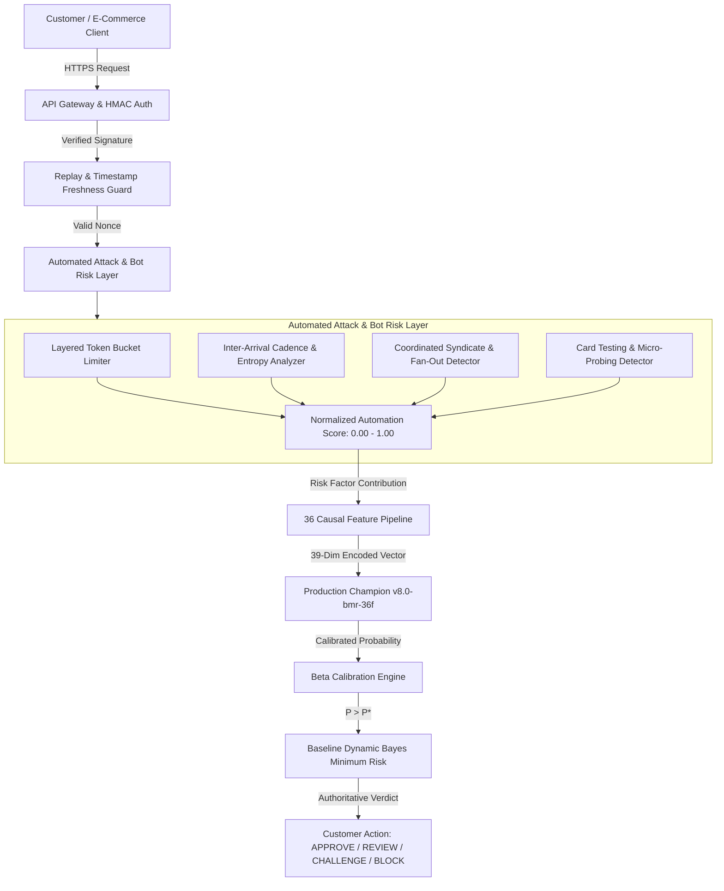

# Automated Attack & Bot Risk Defense Architecture

## 1. Executive Summary & Philosophy

The **Automated Attack & Bot Risk Layer** in ROPUS provides deterministic, behavioral, and statistical defenses against automated fraud, headless browsers, scripted transaction loops, credential abuse, payment card probing, and coordinated attack clusters.

> [!IMPORTANT]
> **Observable Behavior Over Speculative "AI Detection":**
> ROPUS does **not** rely on brittle heuristics claiming to detect "AI-generated text" or user-agent spoofing alone. Rather, it measures **observable temporal behavior, physical cadence anomalies, inter-arrival time entropy, entity fan-out clustering, and cryptographic replay violations**.

---

## 2. Threat Model & Defense Boundaries

### Threat Vectors Mitigated

| Attack Vector | Observable Indicator | Mitigation Mechanism |
| :--- | :--- | :--- |
| **High-Frequency Scripting / Cron Bots** | Fixed inter-arrival intervals ($CV < 0.15$), rapid cadence ($>10\text{ Hz}$). | `CadenceAnalyzer`: Measures inter-arrival variance and timing entropy. |
| **Credential Stuffing / Account Farms** | Single device or IP rotating through $\ge 4$ distinct customer accounts. | `CoordinatedAttackDetector`: Sliding-window account fan-out tracking. |
| **Distributed Botnet / IP Swarm** | Single IP subnet driving $\ge 6$ distinct hardware fingerprints. | `CoordinatedAttackDetector`: IP-to-device cluster fan-out analyzer. |
| **Card Testing / Carding Probing** | Rapid succession of distinct card tokens with micro-amounts ($<\$3.00$). | `CoordinatedAttackDetector`: Device-to-card token probing detector. |
| **Replay Attacks & Nonce Reuse** | Repeated `TransactionID` / `Nonce` or clock drift $>300\text{s}$. | `ReplayProtector`: In-memory LRU nonce cache with TTL. |
| **Headless Browser Automation** | Headless Chrome, Selenium, Playwright, Puppeteer runtime signatures. | `CadenceAnalyzer`: User-Agent automation signature inspection. |
| **Resource Saturation / Quota Bypass** | Rapid transaction requests from single IP, Device, or Account. | `LayeredLimiter`: Multi-tier token-bucket with graduated responses. |

---

## 3. Layered Rate Limiting & Graduated Actions

Rate limiting operates across 5 independent dimensions to prevent single-point bottlenecks:

1. **Tenant Plan Tier**: $100\text{ RPS}$ (Starter), $500\text{ RPS}$ (Growth), $5,000\text{ RPS}$ (Enterprise).
2. **Client IP Address**: $60\text{ req/min}$ ($120\text{ burst capacity}$).
3. **Device Fingerprint**: $30\text{ req/min}$ ($60\text{ burst capacity}$).
4. **Customer Account**: $20\text{ req/min}$ ($40\text{ burst capacity}$).
5. **Payment Instrument Hash**: $15\text{ req/min}$ ($30\text{ burst capacity}$).

### Graduated Response Hierarchy

- **`LOW` ($0.00 - 0.29$)**: Normal transaction processing (`ALLOW`).
- **`MEDIUM` ($0.30 - 0.69$)**: Increased telemetry logging and step-up scrutiny (`SCRUTINIZE`).
- **`HIGH` ($0.70 - 0.89$)**: Additive risk factor contribution to Bayes Minimum Risk composite calculation (`ELEVATE_RISK`).
- **`CRITICAL` ($\ge 0.90$)**: Automated security containment (`CONTAIN` / `BLOCK`).

---

## 4. Statistical Cadence & Timing Entropy

Given a sequence of request arrival timestamps $t_1, t_2, \dots, t_n$, the inter-arrival times are $\Delta t_i = t_i - t_{i-1}$.

1. **Mean Interval**:
   $$\mu = \frac{1}{n-1}\sum_{i=2}^n \Delta t_i$$
2. **Standard Deviation**:
   $$\sigma = \sqrt{\frac{1}{n-1}\sum_{i=2}^n (\Delta t_i - \mu)^2}$$
3. **Coefficient of Variation ($CV$)**:
   $$CV = \frac{\sigma}{\mu}$$

- **Human Traffic**: Natural human pauses exhibit high variability ($CV \ge 0.40$).
- **Deterministic Script / Bot**: Automated sleep loops (e.g. `sleep(0.5)`) produce near-zero variance ($CV < 0.15$), triggering deterministic cadence rules.

---

## 5. Privacy, PCI-DSS & Data Retention Safeguards

- **No Plaintext PAN or CVV**: All payment instruments are referenced strictly via SHA-256 hashed tokens (`tok_...` or `card_hash_...`).
- **Zero-Secret Persistence**: Cryptographic HMAC secrets and API keys are stored in secure KMS / memory; never serialized in logs or decision snapshots.
- **Short-Lived Sliding Windows**: Entity fan-out tracking expires relationships automatically after 15 minutes.
- **Bounded In-Memory Footprint**: LRU nonce and token-bucket caches are capped at $50,000$ entries with automated timestamp TTL eviction.

---

## 6. Fail-Open Architecture & Resilience

> [!TIP]
> **Zero Production Impact on Failure:**
> If the `BotDefenseEngine` encounters an internal panic or nil pointer, a dedicated `defer recover()` handler immediately intercepts the exception, marks `IsDegraded = true`, assigns a baseline risk score ($0.05$), and allows the request to fail-open into standard ML and BMR evaluation without disrupting legitimate customer transactions.

---

## 7. Model Governance Invariance

- **Production Champion**: Active model `v8.0-bmr-36f` (SHA-256 `d473d1ef0c50f232b376c408be37e34c68a258df224277ee1357396e4e627cd7`) remains **100% immutable**.
- **Customer Routing**: Baseline Dynamic BMR remains authoritative.
- **Challenger Status**: LightGBM L20 D4 remains strictly non-enforcing shadow.
