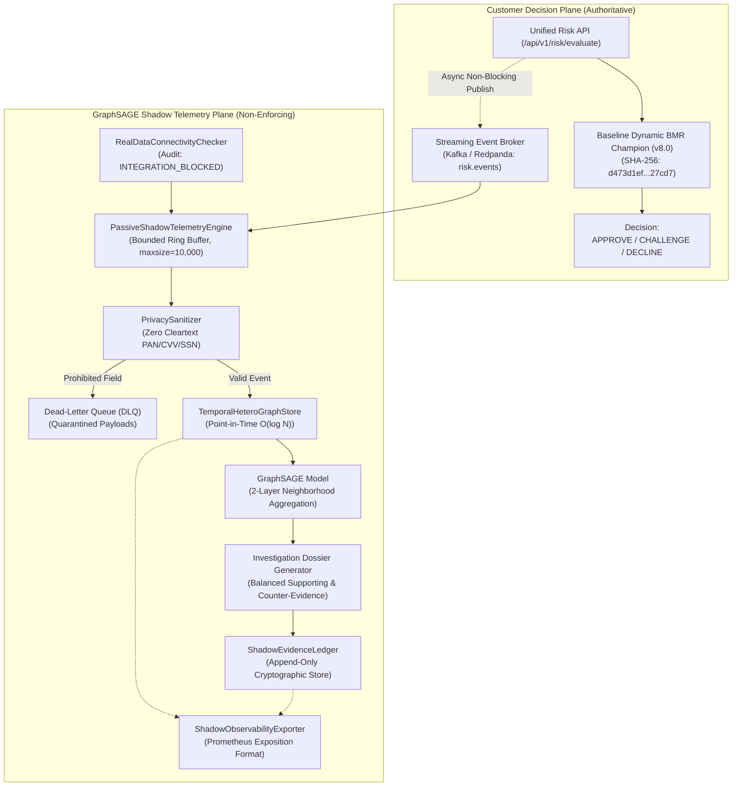

# GraphSAGE Live Shadow Integration & Persistent Observability Architecture

**Document Reference:** `ROPUS-ARCH-GRAPHSAGE-LIVE-SHADOW-2026-08`
**Governance State:** `SYNTHETICALLY_VALIDATED` $\to$ `REAL_DATA_SHADOW_READY` $\to$ `REAL_DATA_REQUIRED` $\to$ `PROMOTION_BLOCKED`
**Active Production Champion:** `ml-service/model/candidates/production_model_v8_bmr.joblib`
**Champion Checksum (SHA-256):** `d473d1ef0c50f232b376c408be37e34c68a258df224277ee1357396e4e627cd7` (**BYTE-FOR-BYTE UNCHANGED**)
**Frozen 52-Case Real Holdout:** `ml-service/data/sample_ieee_fixture.csv`
**Holdout Checksum (SHA-256):** `a30a387ad0fa8743599d6043120be6bd66ac17184b8eee4fb9ce764970201d44` (**BYTE-FOR-BYTE UNCHANGED**)
**Production Customer Routing:** **100% UNCHANGED** (Baseline Dynamic BMR Authoritative)
**GraphSAGE Customer Enforcement:** **0% (STRICTLY NON-ENFORCING SHADOW)**
**Integration Status:** **`INTEGRATION_BLOCKED / CONFIG_REQUIRED`**

---

## 1. Operational Shadow Architecture Overview



---

## 2. Infrastructure Configuration Requirements

To transition from `INTEGRATION_BLOCKED` to `READY_SHADOW`, the following parameters must be configured in staging/production environments:

| Environment Variable | Target System | Description | Required Security / Format |
| :--- | :--- | :--- | :--- |
| `KAFKA_BROKERS` | Kafka / Redpanda | Comma-separated list of broker endpoints | `host1:9092,host2:9092` |
| `KAFKA_SASL_USERNAME` | Kafka Security | Service account identifier for shadow consumer | SASL_SSL / SCRAM-SHA-512 |
| `KAFKA_SASL_PASSWORD` | Kafka Security | Service account secret credential | Vault injected secret |
| `KAFKA_SSL_CA_LOCATION` | Kafka Security | CA certificate path for mTLS validation | `/etc/ssl/certs/kafka-ca.pem` |
| `CLICKHOUSE_HOST` | ClickHouse | Staging/production cluster hostname | `clickhouse.internal` |
| `CLICKHOUSE_USER` | ClickHouse | Database audit role | `shadow_writer` |
| `CLICKHOUSE_PASSWORD` | ClickHouse | Database authentication password | Vault injected secret |
| `PROMETHEUS_PUSHGATEWAY_URL`| Prometheus | Pushgateway or scrape target endpoint | `http://pushgateway.internal:9091` |

---

## 3. Metrics Exposition Contract

The `ShadowObservabilityExporter` exposes operational gauges, counters, and summaries without modifying customer decision latency:

- **Throughput & Lag:** `graphsage_shadow_events_processed_total`, `graphsage_shadow_consumer_lag_events`, `graphsage_shadow_events_dropped_backpressure_total`.
- **Data Quality & Privacy:** `graphsage_shadow_events_dlq_total`, `graphsage_shadow_graph_nodes`, `graphsage_shadow_graph_edges`.
- **Investigation Output:** `graphsage_shadow_dossiers_generated_total`, `graphsage_shadow_score_mean`, `graphsage_shadow_score_p95`.
- **Governance Safety Invariant:** `graphsage_customer_enforcement_authority_pct = 0.0`, `bmr_customer_enforcement_authority_pct = 100.0`.

---

## 4. Governance Gate

```
====================================================================================================
GOVERNANCE GATE: PROMOTION_BLOCKED (DATA_REQUIRED)
CONFIRMED REAL INTERNAL COLLUSION LABELS: 0 / 50 (0.0% Progress)
CUSTOMER DECISION AUTHORITY: 100% BASELINE DYNAMIC BMR (0% GRAPHSAGE ENFORCEMENT)
====================================================================================================
```
