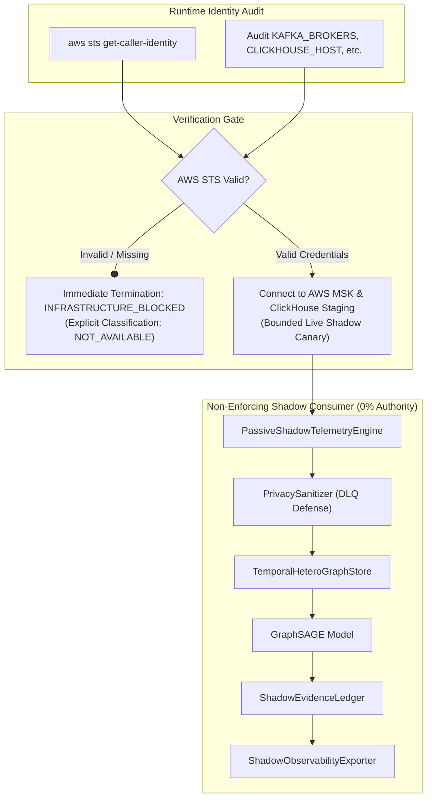

# GraphSAGE Post-Provisioning Connectivity Verification Architecture

**Document Reference:** `ROPUS-ARCH-GRAPHSAGE-POST-PROVISIONING-2026-08`
**Governance State:** `SYNTHETICALLY_VALIDATED` $\to` `REAL_DATA_SHADOW_READY` $\to` `REAL_DATA_REQUIRED` $\to` `PROMOTION_BLOCKED`
**Active Production Champion:** `ml-service/model/candidates/production_model_v8_bmr.joblib`
**Champion Checksum (SHA-256):** `d473d1ef0c50f232b376c408be37e34c68a258df224277ee1357396e4e627cd7` (**BYTE-FOR-BYTE UNCHANGED**)
**Frozen 52-Case Real Holdout:** `ml-service/data/sample_ieee_fixture.csv`
**Holdout Checksum (SHA-256):** `a30a387ad0fa8743599d6043120be6bd66ac17184b8eee4fb9ce764970201d44` (**BYTE-FOR-BYTE UNCHANGED**)
**Production Customer Routing:** **100% UNCHANGED** (Baseline Dynamic BMR Authoritative)
**GraphSAGE Customer Enforcement:** **0% (STRICTLY NON-ENFORCING SHADOW)**
**Connectivity Verification Status:** **`INFRASTRUCTURE_BLOCKED`**
**Real Events Consumed:** **`0 (NOT_AVAILABLE)`**

---

## 1. Post-Provisioning Verification Flow



---

## 2. Metric Classification Matrix

| Metric Field | Observed Value | Classification | Rule |
| :--- | :--- | :--- | :--- |
| **`real_confirmed_internal_collusion_cases`** | `0 / 50` | **`REAL_OBSERVED`** | Authoritative production label state |
| **`graphsage_customer_enforcement_pct`** | `0.0%` | **`REAL_OBSERVED`** | Strict governance routing invariant |
| **`bmr_customer_decision_authority_pct`** | `100.0%` | **`REAL_OBSERVED`** | 100% Baseline Dynamic BMR authority |
| **`production_model_sha256`** | `d473d1ef...` | **`REAL_OBSERVED`** | Cryptographic hash unchanged |
| **`frozen_holdout_sha256`** | `a30a387a...` | **`REAL_OBSERVED`** | Cryptographic hash unchanged |
| **`real_events_consumed`** | `0` | **`NOT_AVAILABLE`** | Staging MSK brokers unreachable |
| **`real_events_persisted`** | `0` | **`NOT_AVAILABLE`** | Staging ClickHouse unreachable |
| **`real_dlq_events`** | `0` | **`NOT_AVAILABLE`** | Staging DLQ unreachable |
| **`shadow_p95_latency_ms`** | `0.0 ms` | **`NOT_AVAILABLE`** | Not executing live inference |

---

## 3. Governance Invariants

```
====================================================================================================
PRODUCTION CHAMPION SHA-256: d473d1ef0c50f232b376c408be37e34c68a258df224277ee1357396e4e627cd7
FROZEN HOLDOUT SHA-256:      a30a387ad0fa8743599d6043120be6bd66ac17184b8eee4fb9ce764970201d44
CONFIRMED REAL CASES:        0 / 50 [REAL_OBSERVED]
GRAPH SAGE ENFORCEMENT:      0% (STRICTLY NON-ENFORCING)
BMR DECISION AUTHORITY:      100% AUTHORITATIVE
PROMOTION GATE:              BLOCKED (DATA_REQUIRED)
====================================================================================================
```
