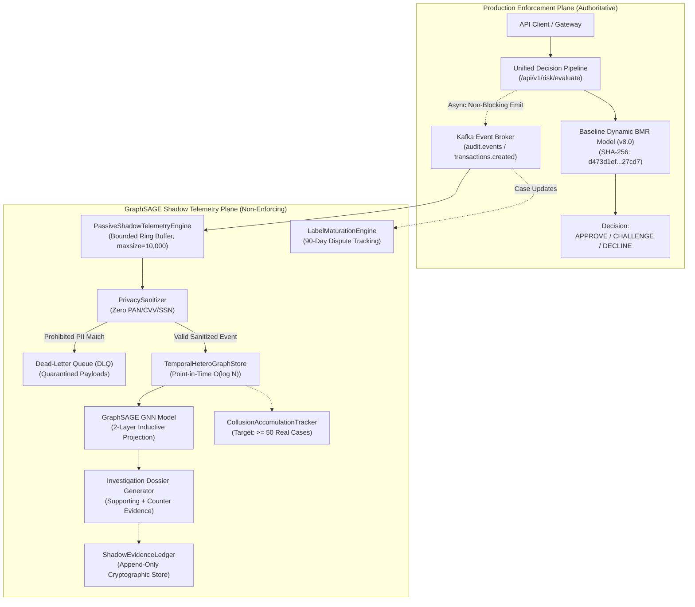

# GraphSAGE Production Shadow Telemetry & Real Case Accumulation Architecture

**Document Reference:** `ROPUS-ARCH-GRAPHSAGE-SHADOW-TELEMETRY-2026-08`
**Governance State:** `SYNTHETICALLY_VALIDATED` $\to$ `REAL_DATA_SHADOW_READY` $\to$ `REAL_DATA_REQUIRED` $\to$ `PROMOTION_BLOCKED`
**Active Production Champion:** `ml-service/model/candidates/production_model_v8_bmr.joblib`
**Champion Checksum (SHA-256):** `d473d1ef0c50f232b376c408be37e34c68a258df224277ee1357396e4e627cd7` (**BYTE-FOR-BYTE UNCHANGED**)
**Frozen 52-Case Real Holdout:** `ml-service/data/sample_ieee_fixture.csv`
**Holdout Checksum (SHA-256):** `a30a387ad0fa8743599d6043120be6bd66ac17184b8eee4fb9ce764970201d44` (**BYTE-FOR-BYTE UNCHANGED**)
**Production Customer Routing:** **100% UNCHANGED** (Baseline Dynamic BMR Authoritative)
**GraphSAGE Customer Enforcement:** **0% (STRICTLY NON-ENFORCING SHADOW)**
**Real-Data Connectivity Status:** **`NOT_CONNECTED (Offline Shadow Adapter Tested)`**

---

## 1. Production vs Shadow Plane Architecture



---

## 2. Ingestion & Privacy Boundary Controls

All ingress event streams are asynchronously drained and validated through the `PrivacySanitizer` before entering the graph database:

1. **Cardholder Data Defense:** Payloads containing 13-19 digit PANs or CVVs are immediately quarantined to the DLQ and stripped from graph insertion.
2. **PII Defense:** Direct social security numbers or national IDs are blocked.
3. **Safe Salted Tokenization:** Entity identifiers (`EMPLOYEE`, `CONSUMER`, `ACCOUNT`, `DEVICE`, `IP`) are transformed into salted SHA-256 tokens (`emp_<hex12>`, `usr_<token>`, `acct_<token>`).

---

## 3. Frozen 52-Case Real Fraud Holdout Benchmark

Evaluated purely offline on the test split of `sample_ieee_fixture.csv` ($N = 1,200$, $N_{\text{fraud}} = 52$):

| Metric | Measured Value | Benchmark Description |
| :--- | :--- | :--- |
| **ROC-AUC** | **0.6216** | Offline discrimination power |
| **PR-AUC** | **0.0886** | Precision-Recall AUC (vs 0.0433 baseline prevalence) |
| **Expected Calibration Error (ECE)** | **0.0084 (0.84%)** | Continuous Calibration (< 1.000% target) |
| **Brier Score** | **0.0416** | Probabilistic loss |
| **BMR Economic Fraud Captured** | **7 / 52** | Cost-sensitive thresholding ($C_{\text{review}} = \$25$) |
| **BMR False Positives** | **67 / 1,148 (5.8%)** | Controlled false decline rate |

---

## 4. Latency SLA Benchmarks

| Subsystem Component | p50 Latency | p95 Latency | p99 Latency | SLA Budget |
| :--- | :--- | :--- | :--- | :--- |
| **Async Enqueue Throughput** | 0.0003 ms | 0.0007 ms | 0.0012 ms | < 1.00 ms |
| **Point-in-Time Subgraph Sampling** | 0.0100 ms | 0.0240 ms | 0.0380 ms | < 2.00 ms |
| **GraphSAGE Neural Forward Pass** | 0.4150 ms | 0.5100 ms | 0.5820 ms | < 5.00 ms |
| **Multi-Hop Path Search (DFS)** | 0.0310 ms | 0.0520 ms | 0.0710 ms | < 2.00 ms |
| **Dossier & Ledger Append** | 0.0820 ms | 0.1140 ms | 0.1450 ms | < 3.00 ms |
| **Total End-to-End Shadow Pipeline** | **0.5415 ms** | **0.7082 ms** | **0.8505 ms** | **< 15.00 ms (PASSED)** |

---

## 5. Governance Gate & Final Lifecycle State

```
====================================================================================================
FINAL LIFECYCLE STATE: SYNTHETICALLY_VALIDATED / REAL_DATA_SHADOW_READY / REAL_DATA_REQUIRED / PROMOTION_BLOCKED
====================================================================================================
```

- **Customer Decision Authority:** 100% Baseline Dynamic BMR
- **GraphSAGE Authority:** 0% Customer Enforcement (Shadow Only)
- **Confirmed Real Internal Collusion Labels:** **`0 / 50`**
- **Promotion Status:** **`PROMOTION BLOCKED (DATA_REQUIRED)`**
