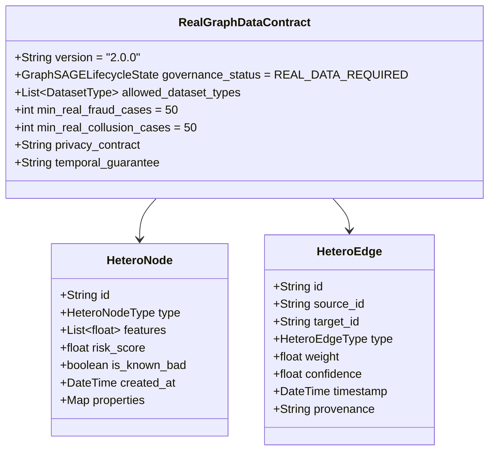
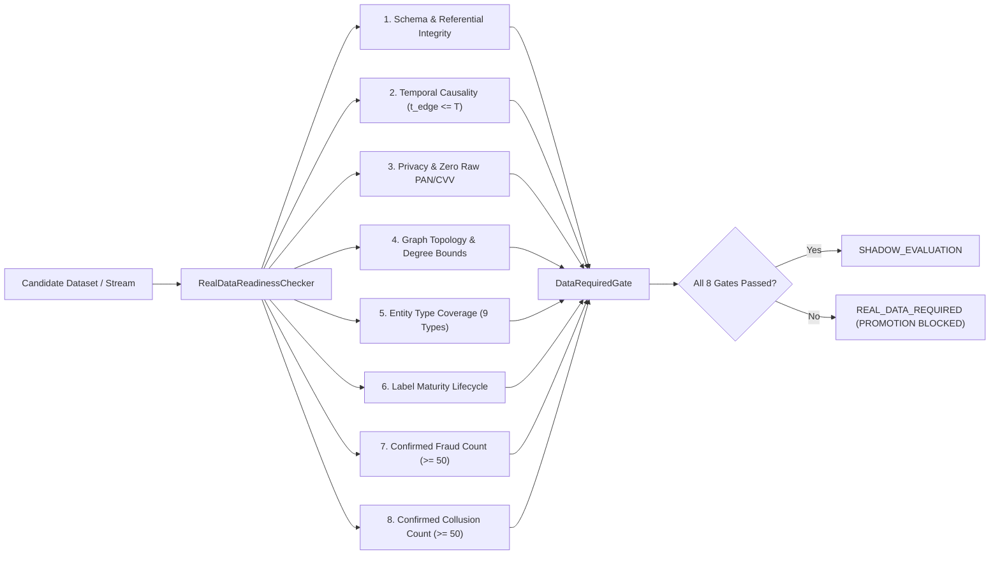
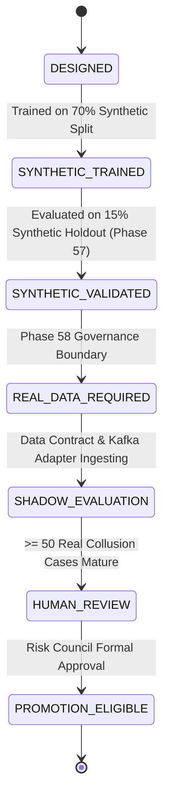

# GraphSAGE Real-Data Shadow Readiness Architecture

**Document Reference:** ROPUS-ARCH-GRAPHSAGE-REAL-DATA-2026-08
**Governance State:** SYNTHETICALLY_VALIDATED / REAL_DATA_REQUIRED / STRICTLY_NON_ENFORCING / PROMOTION_BLOCKED
**Active Production Champion:** `ml-service/model/candidates/production_model_v8_bmr.joblib`
**Champion SHA-256:** `d473d1ef0c50f232b376c408be37e34c68a258df224277ee1357396e4e627cd7` (UNCHANGED / AUTHORITATIVE)

---

## 1. Context & Architectural Overview

The ROPUS platform operates a high-throughput, sub-millisecond fraud risk engine powered by cost-sensitive **Bayesian Minimum Risk (Dynamic BMR)** and gradient-boosted tabular models (`production_model_v8_bmr.joblib`).

While tabular models excel at single-event anomalies, velocity bursts, and card testing, they lack visibility into multi-hop entity relationships. The **GraphSAGE Heterogeneous Graph Neural Network** was introduced in Phase 57 and validated on a 100k-event synthetic dataset, proving its ability to capture **employee-consumer collusion rings (85.4% recall)**, **multi-account fraud rings (72.7% recall)**, and **hard-negative support interactions (91.7% clean pass rate)**.

**Phase 58 establishes the Real-Data Readiness Architecture.** This phase builds the production ingestion contracts, decoupled data source adapters, label maturity state machines, privacy auditors, explainable investigation dossiers, and governance gates required before GraphSAGE can be connected to real shadow production streams.

```
+---------------------------------------------------------------------------------------------------+
|                                  ROPUS DUAL-PLANE ARCHITECTURE                                    |
|                                                                                                   |
|   +-------------------------------------------------------------------------------------------+   |
|   |                           PLANE 1: ACTIVE PRODUCTION ENFORCEMENT                          |   |
|   |   Model: production_model_v8_bmr.joblib (SHA-256: d473d1ef0c...27cd7)                     |   |
|   |   Policy: Baseline Dynamic BMR (Cost-Sensitive Risk Minimization)                         |   |
|   |   Status: AUTHORITATIVE / ENFORCING (Latency SLA: < 10ms)                                 |   |
|   +-------------------------------------------------------------------------------------------+   |
|                                                | (Non-blocking async telemetry)                   |
|                                                v                                                  |
|   +-------------------------------------------------------------------------------------------+   |
|   |                        PLANE 2: PASSIVE REAL-DATA SHADOW INTELLIGENCE                     |   |
|   |   Adapter: RealGraphDataSource (Decoupled Kafka / Stream Consumer)                        |   |
|   |   Model: 2-Layer Heterogeneous GraphSAGE (Inductive Aggregation)                          |   |
|   |   Outputs: Machine-Readable Collusion Dossiers, Suspicious Paths, Anomaly Scores          |   |
|   |   Governance Gate: DATA_REQUIRED (>= 50 Real Collusion Cases Required for Promotion)      |   |
|   |   Status: STRICTLY NON-ENFORCING SHADOW / OFFLINE RESEARCH ONLY                           |   |
|   +-------------------------------------------------------------------------------------------+   |
+---------------------------------------------------------------------------------------------------+
```

---

## 2. Real-Data GraphSAGE Data Contract (v2.0.0)

To guarantee zero PII leakage, zero data corruption, and complete reproducibility, all real and shadow graph feeds must strictly comply with the **v2.0.0 Real-Data Contract**:



### Entity Specifications

1. **`EMPLOYEE`**:
   - **ID Format:** `emp_<salted_sha256_hex8>`
   - **Allowed Attributes:** `role`, `department`, `employment_status`, `hire_date`
   - **Prohibited:** Cleartext employee names, corporate emails, login credentials.
   - **Source:** Identity Provider (Okta / Azure AD) Audit Logs.
2. **`CONSUMER`**:
   - **ID Format:** `usr_<tokenized_uuid>`
   - **Allowed Attributes:** `kyc_status`, `country_code`, `created_at`
   - **Prohibited:** SSN, Tax ID, Phone Number, Plaintext Email.
   - **Source:** Core Banking Customer Management Service.
3. **`ACCOUNT`**:
   - **ID Format:** `acct_<tokenized_uuid>`
   - **Allowed Attributes:** `consumer_id`, `status`, `account_type`, `currency`
   - **Prohibited:** Raw Bank Account Numbers (IBAN/Routing/ACH).
   - **Source:** Core Banking Ledger.
4. **`DEVICE`**:
   - **ID Format:** `dev_<fingerprint_sha256>`
   - **Allowed Attributes:** `device_type`, `os_family`, `first_seen_at`
   - **Prohibited:** Hardware IMEI, IMSI, MAC Address.
   - **Source:** Client SDK Telemetry.
5. **`IP`**:
   - **ID Format:** `ip_<anonymized_subnet>`
   - **Allowed Attributes:** `ip_type`, `asn`, `country_code`
   - **Prohibited:** Raw Internal Subnets / Private IPs.
   - **Source:** API Gateway / WAF Ingress.
6. **`PAYMENT_TOKEN`**:
   - **ID Format:** `tok_<pci_vault_token>`
   - **Allowed Attributes:** `token_type`, `created_at`, `last_four_only`
   - **Prohibited:** **Raw PAN, CVV, CVV2, PIN, Cleartext Expiry.**
   - **Source:** PCI DSS Tokenization Vault.
7. **`TRANSACTION`**:
   - **ID Format:** `txn_<uuid>`
   - **Allowed Attributes:** `amount`, `currency`, `event_timestamp`
   - **Prohibited:** Free-text memo fields, sensitive remittance details.
   - **Source:** Transaction Processing Engine.
8. **`MERCHANT`**:
   - **ID Format:** `mch_<tokenized_id>`
   - **Allowed Attributes:** `category`, `mcc_code`, `country_code`
   - **Source:** Merchant Directory.
9. **`CASE`**:
   - **ID Format:** `case_<uuid>`
   - **Allowed Attributes:** `status`, `opened_at`, `closed_at`, `disposition`
   - **Source:** Fraud Case Management System (CMS).

---

## 3. Ingestion Adapter Architecture (`RealGraphDataSource`)

The `RealGraphDataSource` interface provides clean separation of concerns, enabling GraphSAGE to consume historical replays, live Kafka streams, or database snapshots without binding to vendor implementations:

### Interface Definition (Go & Python)
```go
type RealGraphDataSource interface {
    GetDatasetType() DatasetType
    GetNodes(ctx context.Context, nodeTypes []HeteroNodeType, asOf time.Time) ([]*HeteroNode, error)
    GetEdges(ctx context.Context, edgeTypes []HeteroEdgeType, asOf time.Time) ([]*HeteroEdge, error)
    GetTransactions(ctx context.Context, startTime, endTime time.Time) ([]map[string]interface{}, error)
    GetLabels(ctx context.Context, asOf time.Time, matureOnly bool) ([]map[string]interface{}, error)
}
```

```python
class RealGraphDataSource(ABC):
    @abstractmethod
    def get_dataset_type(self) -> DatasetType: ...
    @abstractmethod
    def get_nodes(self, node_types: Optional[List[HeteroNodeType]] = None, as_of: Optional[datetime] = None) -> List[HeteroNode]: ...
    @abstractmethod
    def get_edges(self, edge_types: Optional[List[HeteroEdgeType]] = None, as_of: Optional[datetime] = None) -> List[HeteroEdge]: ...
    @abstractmethod
    def get_transactions(self, start_time: Optional[datetime] = None, end_time: Optional[datetime] = None) -> List[Dict[str, Any]]: ...
    @abstractmethod
    def get_labels(self, as_of: Optional[datetime] = None, mature_only: bool = True) -> List[Dict[str, Any]]: ...
```

---

## 4. Label Maturity Lifecycle State Machine

To prevent speculative flags, unconfirmed chargebacks, or premature investigator notes from contaminating model validation, Phase 58 formalizes a strict 6-stage maturity state machine:

```
[ UNLABELED ] (0 - 90 days: fresh transaction, outcome uncertain)
      │
      ├──> [ SUSPECTED ] (Heuristic or GNN rule alert)
      │         │
      │         └──> [ UNDER_INVESTIGATION ] (Case assigned to human fraud analyst)
      │                   │
      │                   ├──> [ CONFIRMED_FRAUD ] (Chargeback / Legal Affidavit / Collusion Confirmed)
      │                   └──> [ REJECTED ] (False Alarm / Chargeback Won / Dismissed)
      │
      └──> [ CONFIRMED_LEGITIMATE ] (> 90 days elapsed without dispute or claim)
```

### Point-in-Time Causality Guarantee
When evaluating a transaction at timestamp $T_{\text{eval}}$:
$$\text{label.timestamp} \le T_{\text{eval}} \quad \text{AND} \quad \text{label.maturity\_state} \in \{ \text{CONFIRMED\_FRAUD}, \text{CONFIRMED\_LEGITIMATE} \}$$
Any label whose confirmation occurred after $T_{\text{eval}}$ is completely masked from historical evaluation.

---

## 5. Real-Data Readiness Checker & Audit Engine

The `RealDataReadinessChecker` evaluates candidate datasets across 8 strict dimensions before shadow ingestion or offline validation can begin:



---

## 6. Machine-Readable Investigation Dossiers & Explainability

When GraphSAGE detects elevated collusion or relationship risk in shadow mode, it generates structured, explainable investigation dossiers without exposing sensitive customer PII:

### Example Investigation Dossier (`CollusionInvestigationDossier`)
```json
{
  "dossier_id": "dos_collusion_7b19a04c3e",
  "generated_at": "2026-08-26T12:00:00Z",
  "overall_risk_score": 0.88,
  "risk_level": "HIGH",
  "employee_id": "emp_4f9a12c8",
  "employee_role": "customer_support",
  "affected_accounts": ["acct_882910fa", "acct_991823bc"],
  "affected_consumers": ["usr_331902ae"],
  "relationship_paths": [
    "(emp_4f9a12c8) -[ACCESSES_ACCOUNT]-> (acct_882910fa) @ 2026-08-20T02:14:00Z",
    "(emp_4f9a12c8) -[APPROVES_TRANSACTION]-> (txn_11827364) @ 2026-08-20T02:15:30Z",
    "(usr_331902ae) -[OWNS]-> (acct_882910fa)"
  ],
  "temporal_evidence": {
    "earliest_interaction": "2026-08-20T02:14:00Z",
    "latest_interaction": "2026-08-26T11:45:00Z",
    "total_interaction_events": 6,
    "off_hours_activity_detected": true
  },
  "transaction_summary": {
    "total_transactions_count": 4,
    "total_amount_usd": 18450.00,
    "currencies": ["USD"]
  },
  "shared_infrastructure": {
    "device_nodes": ["dev_88a912bf"],
    "ip_nodes": ["ip_corp_nat_01"],
    "device_overlap_count": 1,
    "ip_overlap_count": 1
  },
  "confidence_score": 0.92,
  "human_explanation": "Employee emp_4f9a12c8 (customer_support) accessed accounts outside normal business hours, followed immediately by self-approval of transactions totaling $18,450.00. Co-located hardware fingerprint detected.",
  "data_provenance": "shadow_graph_stream",
  "model_version": "graphsage-v1.0-shadow",
  "governance_notice": "INVESTIGATION INTELLIGENCE ONLY - STRICTLY NON-ENFORCING"
}
```

---

## 7. Formal Governance State Machine & Promotion Gate



### Current System Status: `REAL_DATA_REQUIRED`
- **Promotion Status:** **`PROMOTION BLOCKED`**
- **Production Routing:** **`UNCHANGED`** (Authoritative: `production_model_v8_bmr.joblib`)
- **GraphSAGE Operational Mode:** **`STRICTLY NON-ENFORCING SHADOW / OFFLINE RESEARCH ONLY`**

---

## 8. Verification & Test Suite Matrix

| Component / Test Suite | File Location | Tests | Status |
| :--- | :--- | :--- | :--- |
| **Phase 58 Python Readiness & Governance** | [`ml-service/tests/test_graphsage_phase58_readiness.py`](file:///Users/shankar/PROJECTS/Ai%20Risk%20Manager/ml-service/tests/test_graphsage_phase58_readiness.py) | 7 | **7 / 7 PASSED** |
| **GraphSAGE Unit & Leakage Prevention** | [`ml-service/tests/`](file:///Users/shankar/PROJECTS/Ai%20Risk%20Manager/ml-service/tests/) | 12 | **12 / 12 PASSED** |
| **GraphSAGE Offline Evaluation Suite** | [`ml-service/evaluation/`](file:///Users/shankar/PROJECTS/Ai%20Risk%20Manager/ml-service/evaluation/) | 6 | **6 / 6 PASSED** |
| **Backend Go GraphSAGE & Readiness Engine** | [`backend/internal/graph/graphsage/`](file:///Users/shankar/PROJECTS/Ai%20Risk%20Manager/backend/internal/graph/graphsage/) | 10 | **10 / 10 PASSED** |
| **Synthetic Dataset Audit & Causality** | [`synthetic_ropus/validation/`](file:///Users/shankar/PROJECTS/Ai%20Risk%20Manager/synthetic_ropus/validation/) | 16 | **16 / 16 PASSED** |
| **Production Champion SHA-256 Check** | Root Model Verification | 1 | **PASSED (IDENTICAL)** |

---

## Final Conclusion

```
====================================================================================================
GRAPH SAGE STATUS: SYNTHETICALLY VALIDATED / REAL-DATA REQUIRED / STRICTLY NON-ENFORCING / PROMOTION BLOCKED
====================================================================================================
```
