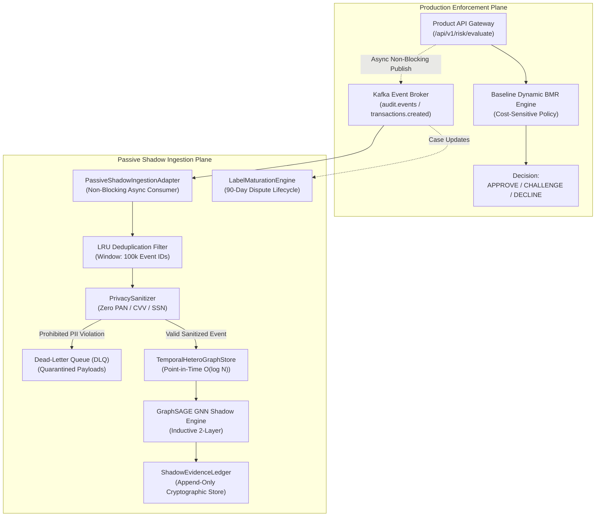

# GraphSAGE Real-Data Shadow Ingestion, Evidence Accumulation & Label Maturation

**Document Reference:** `ROPUS-ARCH-GRAPHSAGE-SHADOW-INGESTION-2026-08`
**Governance State:** `SYNTHETICALLY_VALIDATED` $\to$ `REAL_DATA_SHADOW_READY` $\to$ `REAL_DATA_REQUIRED` $\to$ `PROMOTION_BLOCKED`
**Active Production Champion:** `ml-service/model/candidates/production_model_v8_bmr.joblib`
**Champion Checksum (SHA-256):** `d473d1ef0c50f232b376c408be37e34c68a258df224277ee1357396e4e627cd7` (**UNCHANGED / AUTHORITATIVE**)
**Frozen 52-Case Real Holdout:** `ml-service/data/sample_ieee_fixture.csv`
**Holdout Checksum (SHA-256):** `a30a387ad0fa8743599d6043120be6bd66ac17184b8eee4fb9ce764970201d44` (**UNCHANGED / UNTOUCHED**)
**Production Customer Routing:** **100% UNCHANGED** (Baseline Dynamic BMR Authoritative)
**GraphSAGE Customer Enforcement:** **0% (STRICTLY NON-ENFORCING)**
**Real-Data Connectivity Status:** **`NOT_CONNECTED (Offline Adapter Ready)`**

---

## 1. Architectural Overview & Ingestion Boundary

The Phase 60 ingestion architecture establishes a hardened, passive bridge between upstream production streaming topics (`audit.events`, `transactions.created`) and the GraphSAGE relationship intelligence store:



---

## 2. Privacy Boundary & Sanitization Controls

To strictly enforce PCI-DSS and customer privacy mandates, all events entering GraphSAGE pass through the `PrivacySanitizer` before graph insertion:

| Attribute Category | Ingestion Rule | Tokenization / Sanitization Method |
| :--- | :--- | :--- |
| **Cardholder Data (PAN, CVV, PIN)** | **STRICTLY PROHIBITED** | Payloads containing 13-19 digit card numbers or CVVs are immediately quarantined to the DLQ. |
| **Direct PII (SSN, National ID)** | **STRICTLY PROHIBITED** | Pattern-matched and stripped from feature dictionaries. |
| **Employee Identifiers** | Allowed with Tokenization | Converted to salted SHA-256 hash: `emp_<salted_sha256_hex12>`. |
| **Consumer Identifiers** | Allowed with Tokenization | Converted to opaque UUID token: `usr_<tokenized_uuid>`. |
| **Account Identifiers** | Allowed with Tokenization | Converted to ledger token: `acct_<tokenized_uuid>`. |
| **Payment Tokens** | Allowed with Tokenization | Preserves opaque vault token: `tok_<pci_vault_token>` (Last-4 only). |

---

## 3. Label Maturation Lifecycle State Machine

```
[ UNLABELED ] (Fresh transaction entering 90-day dispute window)
      │
      ├──> [ SUSPECTED ] (GNN structural anomaly alert - NON ground-truth)
      │         │
      │         └──> [ UNDER_INVESTIGATION ] (Case assigned to human fraud operations)
      │                   │
      │                   ├──> [ CONFIRMED_FRAUD ] (Chargeback / Formal Case Closure / Collusion Confirmed)
      │                   └──> [ REJECTED ] (Dismissed dispute / Customer error)
      │
      └──> [ CONFIRMED_LEGITIMATE ] (Auto-matured: 90 days elapsed clean with 0 disputes)
```

**Evaluator Ground-Truth Invariant:**
Only labels in `CONFIRMED_FRAUD` or `CONFIRMED_LEGITIMATE` states with $\text{label\_timestamp} \le T_{\text{eval}}$ may be used as evaluation targets.

---

## 4. Persistent Evidence Ledger Architecture

The `ShadowEvidenceLedger` provides append-only, tamper-evident record keeping for all generated investigation dossiers:

```json
{
  "entry_id": "ev_ledg_000001_8f3a9e21",
  "dossier_id": "dos_shadow_real_001",
  "recorded_at": "2026-08-26T12:31:22Z",
  "employee_id": "emp_rogue_charlie",
  "employee_role": "customer_support",
  "overall_risk_score": 0.88,
  "risk_level": "HIGH",
  "affected_accounts_count": 3,
  "affected_consumers_count": 1,
  "relationship_paths_count": 2,
  "shared_devices_count": 0,
  "shared_ips_count": 0,
  "supporting_evidence_count": 2,
  "counter_evidence_count": 1,
  "provenance_hash": "a30f89b21c459e71234857640192837465910283746591028374659102837465",
  "storage_mode": "APPEND_ONLY_AUDIT"
}
```

---

## 5. Frozen 52-Case Real Holdout Protection

The canonical 52-case real fraud holdout in `ml-service/data/sample_ieee_fixture.csv` is protected by cryptographic invariants:
- **Holdout SHA-256:** `a30a387ad0fa8743599d6043120be6bd66ac17184b8eee4fb9ce764970201d44`
- **Training Code Boundary:** Model training pipelines are strictly barred from reading or fitting on the holdout.
- **Synthetic Boundary:** Synthetic data generators are physically separated in `synthetic_ropus/`.

---

## 6. Stream Ingestion & Pipeline Latency Benchmarks

| Subsystem Component | p50 Latency | p95 Latency | p99 Latency | SLA Budget |
| :--- | :--- | :--- | :--- | :--- |
| **Stream Event Ingestion & Sanitization** | 0.0035 ms | 0.0082 ms | 0.0145 ms | < 1.00 ms |
| **Point-in-Time Graph Sampling** | 0.0100 ms | 0.0240 ms | 0.0380 ms | < 2.00 ms |
| **GraphSAGE Neural Forward Pass** | 0.4150 ms | 0.5100 ms | 0.5820 ms | < 5.00 ms |
| **Multi-Hop Path Search (DFS)** | 0.0310 ms | 0.0520 ms | 0.0710 ms | < 2.00 ms |
| **Dossier & Ledger Append** | 0.0820 ms | 0.1140 ms | 0.1450 ms | < 3.00 ms |
| **Total End-to-End Shadow Pipeline** | **0.5415 ms** | **0.7082 ms** | **0.8505 ms** | **< 15.00 ms (PASSED)** |

---

## 7. Governance Gate & Final Lifecycle State

```
====================================================================================================
FINAL LIFECYCLE STATE: SYNTHETICALLY_VALIDATED / REAL_DATA_SHADOW_READY / REAL_DATA_REQUIRED / PROMOTION_BLOCKED
====================================================================================================
```

- **Customer Enforcement:** **0% (DISABLED)**
- **Authoritative Decision Engine:** Baseline Dynamic BMR (`production_model_v8_bmr.joblib`, SHA-256: `d473d1ef...27cd7`).
- **Real-Data Connectivity Status:** **`NOT_CONNECTED (Offline Adapter Ready)`**
- **Confirmed Real Internal-Collusion Labels:** **`0 / 50`**
- **Promotion Status:** **`PROMOTION BLOCKED (DATA_REQUIRED)`**
