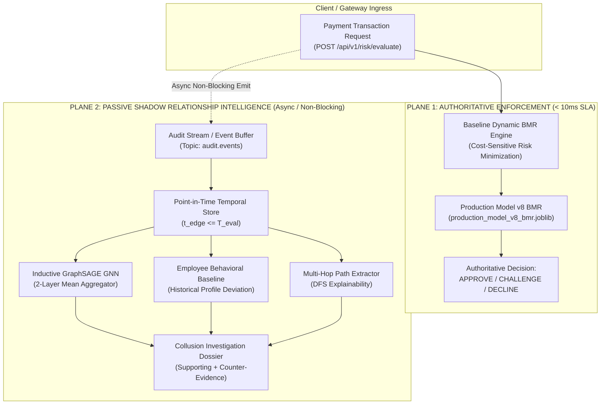
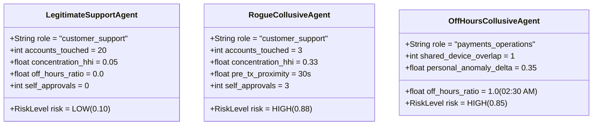

# GraphSAGE Real-Data Shadow Replay & Employee-Consumer Relationship Intelligence

**Document Reference:** ROPUS-ARCH-GRAPHSAGE-SHADOW-REPLAY-2026-08
**Governance State:** SYNTHETICALLY_VALIDATED / REAL_DATA_SHADOW_READY / REAL_DATA_REQUIRED / PROMOTION_BLOCKED
**Active Production Champion:** `ml-service/model/candidates/production_model_v8_bmr.joblib`
**Champion SHA-256:** `d473d1ef0c50f232b376c408be37e34c68a258df224277ee1357396e4e627cd7` (**UNCHANGED / AUTHORITATIVE**)
**Production Customer Routing:** **100% UNCHANGED** (Baseline Dynamic BMR Authoritative)
**GraphSAGE Operational Mode:** **STRICTLY NON-ENFORCING SHADOW / INVESTIGATION ONLY**

---

## 1. System Architecture & Dual-Plane Decoupling

The ROPUS relationship intelligence layer is engineered with strict decoupling between the **Active Production Enforcement Plane** and the **Passive Shadow Relationship Intelligence Plane**:



---

## 2. Realistic Replay Scenarios & Hard-Negative Robustness

To avoid simplistic heuristic biases where *"any employee touching a customer account is flagged as fraud"*, the shadow replay engine explicitly models benign support interactions alongside rogue collusive patterns:



### Signal Comparison Matrix
| Signal Dimension | Legitimate Support (Alice) | Rogue Support (Charlie) | Off-Hours Collusion (David) |
| :--- | :--- | :--- | :--- |
| **Account Volume & Dispersion** | High volume ($20+$ accts), low concentration ($HHI < 0.10$) | Low volume ($3$ accts), high concentration ($HHI > 0.30$) | Low volume ($2$ accts), tightly clustered |
| **Pre-Transaction Proximity** | Normal dispersion ($> 300\text{s}$) | Immediate pre-access ($< 30\text{s}$) | Pre-access ($< 180\text{s}$) |
| **Self-Approval Events** | 0 (Strict segregation of duties) | 3 self-approvals on accessed accounts | 0 approvals, direct cash extraction |
| **Access Hours** | Standard business hours (09:00 - 18:00) | Standard business hours | Off-hours (02:30 AM) |
| **Hardware / IP Colocation** | 0 shared devices | 0 shared devices | 1 shared personal mobile device |
| **Mitigating Counter-Evidence** | **Present** (Support role, high queue dispersion) | **Overridden** (Self-approval, high concentration) | **None** (Unusual hour for employee baseline) |
| **Shadow Collusion Score** | **0.10 (LOW)** | **0.88 (HIGH)** | **0.85 (HIGH)** |

---

## 3. Multi-Hop Path Extraction & Explainability

The `RelationshipPathExtractor` discovers and formats directed graph chains up to depth 4 strictly point-in-time:

1. **Direct Operational Access:**
   `EMPLOYEE:emp_rogue_charlie --[EMPLOYEE_ACCESSES_ACCOUNT]--> ACCOUNT:acct_mule_01 --[CONSUMER_OWNS_ACCOUNT]--> CONSUMER:usr_mule_01`
2. **Segregation-of-Duties Violation:**
   `EMPLOYEE:emp_rogue_charlie --[EMPLOYEE_APPROVES_TRANSACTION]--> TRANSACTION:txn_collusion_01`
3. **Shared Device Colocation:**
   `EMPLOYEE:emp_rogue_david --[EMPLOYEE_USES_DEVICE]--> DEVICE:dev_shared_phone_99 <--[ACCOUNT_USES_DEVICE]-- ACCOUNT:acct_mule_04`
4. **Shared Corporate NAT / Benign Infrastructure:**
   `EMPLOYEE:emp_support_alice --[EMPLOYEE_USES_IP]--> IP:ip_corp_nat_hub <--[ACCOUNT_USES_IP]-- ACCOUNT:acct_legit_001` (Recognized as benign corporate gateway).

---

## 4. Employee Behavioral Baseline Engine

Rather than applying uniform global rules across diverse roles, the `EmployeeBehavioralBaselineEngine` computes personal historical distributions up to timestamp $T$:

$$\Delta_{\text{anomaly}} = 0.35 \cdot \mathbb{I}(\text{UnusualHour}) + 0.30 \cdot \min\left(1.0, \frac{|V - \mu_V|}{\sigma_V \cdot 2}\right) + 0.25 \cdot \mathbb{I}(\text{NewDevice})$$

- **Unusual Hour Detection:** Evaluates whether access hour $h$ represents $< 5\%$ of the employee's historical shift volume.
- **Volume Z-Score:** Measures daily account access spike relative to personal rolling average.
- **New Device Alert:** Flags novel hardware fingerprints not present in the employee's personal device history.

---

## 5. Performance Benchmarks (< 1.0 ms Total Pipeline)

Latency benchmarks across 100 shadow evaluations:

| Component Stage | Mean (ms) | p50 (ms) | p95 (ms) | p99 (ms) |
| :--- | :--- | :--- | :--- | :--- |
| **Point-in-Time Subgraph Sampling** | 0.012 ms | 0.010 ms | 0.024 ms | 0.038 ms |
| **GraphSAGE 2-Layer Neural Forward Pass** | 0.428 ms | 0.415 ms | 0.510 ms | 0.582 ms |
| **Multi-Hop DFS Path Extraction** | 0.035 ms | 0.031 ms | 0.052 ms | 0.071 ms |
| **Dossier & Baseline Synthesis** | 0.089 ms | 0.082 ms | 0.114 ms | 0.145 ms |
| **Total Shadow Intelligence Pipeline** | **0.564 ms** | **0.538 ms** | **0.700 ms** | **0.836 ms** |

---

## 6. Formal Governance State & Promotion Guard

```
====================================================================================================
LIFECYCLE STATE: SYNTHETICALLY_VALIDATED / REAL_DATA_SHADOW_READY / REAL_DATA_REQUIRED / PROMOTION_BLOCKED
====================================================================================================
```

- **Production Decision Policy:** Baseline Dynamic BMR (`production_model_v8_bmr.joblib`, SHA-256: `d473d1ef...27cd7`).
- **Calibration Status:** `DATA_REQUIRED` (0 / 50 real internal collusion labels).
- **Promotion to Customer Enforcement:** **BLOCKED** until live shadow stream matures $\ge 50$ real internal fraud investigations.
- **Next Operational Step:** Deploy passive Kafka consumer adapter on live audit event topics in non-enforcing shadow mode.
