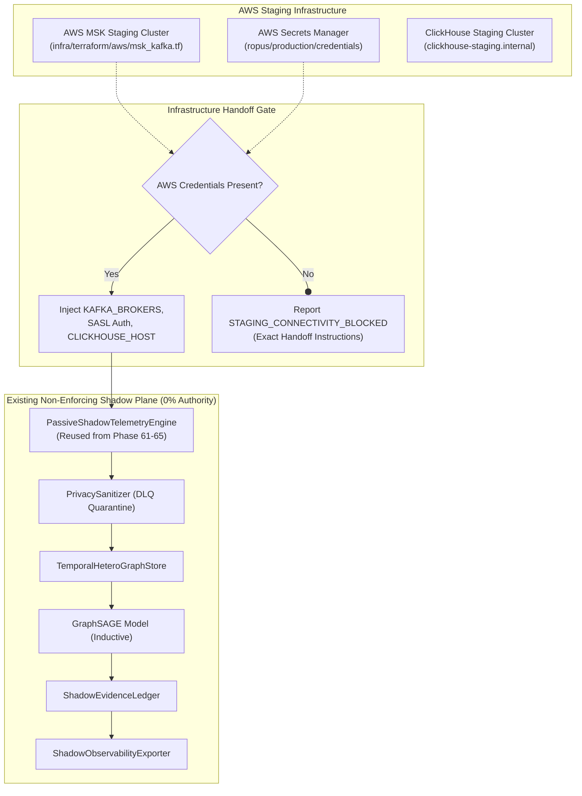

# GraphSAGE Real Staging Activation & Infrastructure Handoff Architecture

**Document Reference:** `ROPUS-ARCH-GRAPHSAGE-STAGING-ACTIVATION-2026-08`
**Governance State:** `SYNTHETICALLY_VALIDATED` $\to$ `REAL_DATA_SHADOW_READY` $\to$ `REAL_DATA_REQUIRED` $\to$ `PROMOTION_BLOCKED`
**Active Production Champion:** `ml-service/model/candidates/production_model_v8_bmr.joblib`
**Champion Checksum (SHA-256):** `d473d1ef0c50f232b376c408be37e34c68a258df224277ee1357396e4e627cd7` (**BYTE-FOR-BYTE UNCHANGED**)
**Frozen 52-Case Real Holdout:** `ml-service/data/sample_ieee_fixture.csv`
**Holdout Checksum (SHA-256):** `a30a387ad0fa8743599d6043120be6bd66ac17184b8eee4fb9ce764970201d44` (**BYTE-FOR-BYTE UNCHANGED**)
**Production Customer Routing:** **100% UNCHANGED** (Baseline Dynamic BMR Authoritative)
**GraphSAGE Customer Enforcement:** **0% (STRICTLY NON-ENFORCING SHADOW)**
**Real Staging Connectivity:** **`BLOCKED (Missing AWS MSK staging credentials)`**
**Real Staging Events Consumed:** **`0`**

---

## 1. Staging Activation & Handoff Architecture



---

## 2. Infrastructure Handoff Specification

```
====================================================================================================
STEP 1: Provision active AWS credentials in the target runtime:
        export AWS_ACCESS_KEY_ID="<staging_key>"
        export AWS_SECRET_ACCESS_KEY="<staging_secret>"
        export AWS_DEFAULT_REGION="us-east-1"

STEP 2: Extract staging secrets from AWS Secrets Manager:
        aws secretsmanager get-secret-value --secret-id ropus/production/credentials

STEP 3: Export environment variables into runtime:
        export KAFKA_BROKERS="b-1.ropus-kafka-staging.internal:9092,b-2.ropus-kafka-staging.internal:9092"
        export KAFKA_SASL_USERNAME="<shadow_user>"
        export KAFKA_SASL_PASSWORD="<shadow_pass>"
        export CLICKHOUSE_HOST="clickhouse-staging.internal"

STEP 4: Run the activation runner:
        python3 ml-service/evaluation/run_phase66_real_staging_activation.py
====================================================================================================
```

---

## 3. Governance Invariants

```
====================================================================================================
PRODUCTION CHAMPION SHA-256: d473d1ef0c50f232b376c408be37e34c68a258df224277ee1357396e4e627cd7
FROZEN HOLDOUT SHA-256:      a30a387ad0fa8743599d6043120be6bd66ac17184b8eee4fb9ce764970201d44
CONFIRMED REAL CASES:        0 / 50
GRAPH SAGE ENFORCEMENT:      0% (STRICTLY NON-ENFORCING)
BMR DECISION AUTHORITY:      100% AUTHORITATIVE
PROMOTION GATE:              BLOCKED (DATA_REQUIRED)
====================================================================================================
```
