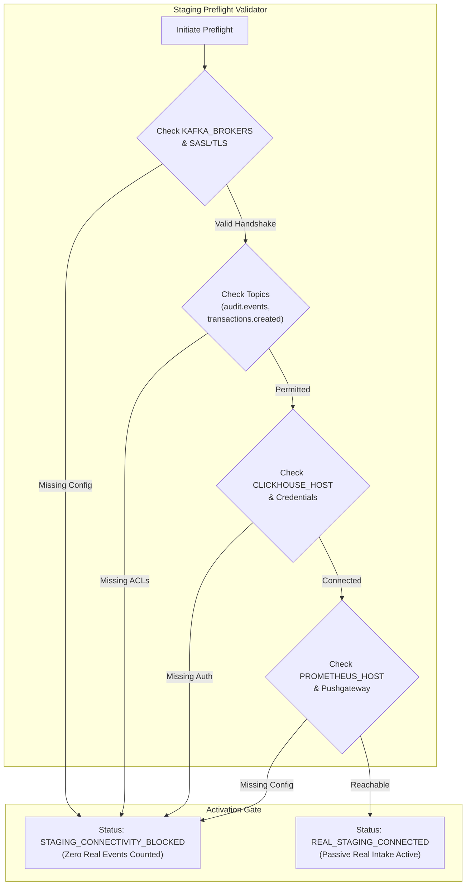

# GraphSAGE Real Staging Connectivity & Preflight Architecture

**Document Reference:** `ROPUS-ARCH-GRAPHSAGE-STAGING-PREFLIGHT-2026-08`
**Governance State:** `SYNTHETICALLY_VALIDATED` $\to$ `REAL_DATA_SHADOW_READY` $\to$ `REAL_DATA_REQUIRED` $\to$ `PROMOTION_BLOCKED`
**Active Production Champion:** `ml-service/model/candidates/production_model_v8_bmr.joblib`
**Champion Checksum (SHA-256):** `d473d1ef0c50f232b376c408be37e34c68a258df224277ee1357396e4e627cd7` (**BYTE-FOR-BYTE UNCHANGED**)
**Frozen 52-Case Real Holdout:** `ml-service/data/sample_ieee_fixture.csv`
**Holdout Checksum (SHA-256):** `a30a387ad0fa8743599d6043120be6bd66ac17184b8eee4fb9ce764970201d44` (**BYTE-FOR-BYTE UNCHANGED**)
**Production Customer Routing:** **100% UNCHANGED** (Baseline Dynamic BMR Authoritative)
**GraphSAGE Customer Enforcement:** **0% (STRICTLY NON-ENFORCING SHADOW)**
**Preflight Status:** **`STAGING_CONNECTIVITY_BLOCKED (Minimum infrastructure credentials required)`**

---

## 1. Staging Preflight Dependency Verification Flow



---

## 2. Dependency Audit Matrix

| Dependency | Required Configuration | Current Evaluation | Result |
| :--- | :--- | :--- | :--- |
| **AWS MSK / Kafka Brokers** | `KAFKA_BROKERS` | Missing | `MISSING_CONFIG` |
| **Kafka Authentication** | `KAFKA_SASL_USERNAME` / `KAFKA_SSL_CA_LOCATION` | Missing | `MISSING_CONFIG` |
| **Topic: audit.events** | Read ACLs on `audit.events` | Cannot verify | `MISSING_CONFIG` |
| **Topic: transactions.created**| Read ACLs on `transactions.created` | Cannot verify | `MISSING_CONFIG` |
| **Consumer Group** | Read/Commit ACLs on `graphsage-shadow-group` | Cannot verify | `MISSING_CONFIG` |
| **ClickHouse Store** | `CLICKHOUSE_HOST`, `CLICKHOUSE_USER`, `CLICKHOUSE_PASSWORD` | Missing | `MISSING_CONFIG` |
| **Prometheus Exporter** | `PROMETHEUS_PUSHGATEWAY_URL` / `PROMETHEUS_HOST` | Missing | `MISSING_CONFIG` |

---

## 3. Required Infrastructure Unblocking Actions

1. **Export Staging MSK Endpoints:** Set `KAFKA_BROKERS=b-1.ropus-kafka-staging.internal:9092,b-2.ropus-kafka-staging.internal:9092`.
2. **Inject Staging Secrets:** Retrieve `kafka_auth` from AWS Secrets Manager (`ropus/production/credentials`).
3. **Configure ClickHouse Host:** Set `CLICKHOUSE_HOST=clickhouse-staging.internal` and database credentials.
4. **Configure Metrics Exporter:** Set `PROMETHEUS_PUSHGATEWAY_URL` or expose `/metrics` for scrape agent.

---

## 4. Governance Invariants

```
====================================================================================================
GRAPH SAGE CUSTOMER ENFORCEMENT: 0% (STRICTLY NON-ENFORCING)
BASELINE DYNAMIC BMR AUTHORITY:  100% AUTHORITATIVE
CONFIRMED REAL COLLUSION CASES:  0 / 50 (0.0% Progress)
GOVERNANCE PROMOTION GATE:       BLOCKED (DATA_REQUIRED)
====================================================================================================
```
