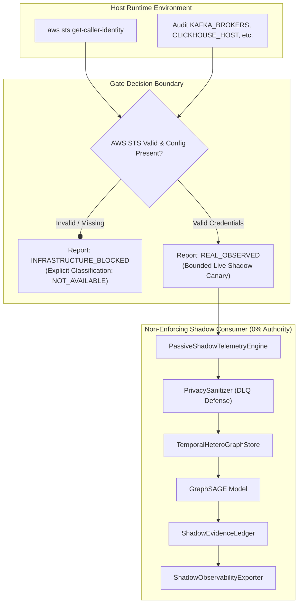

# GraphSAGE Real Staging Infrastructure Gate Architecture

**Document Reference:** `ROPUS-ARCH-GRAPHSAGE-INFRASTRUCTURE-GATE-2026-08`
**Governance State:** `SYNTHETICALLY_VALIDATED` $\to$ `REAL_DATA_SHADOW_READY` $\to$ `REAL_DATA_REQUIRED` $\to$ `PROMOTION_BLOCKED`
**Active Production Champion:** `ml-service/model/candidates/production_model_v8_bmr.joblib`
**Champion Checksum (SHA-256):** `d473d1ef0c50f232b376c408be37e34c68a258df224277ee1357396e4e627cd7` (**BYTE-FOR-BYTE UNCHANGED**)
**Frozen 52-Case Real Holdout:** `ml-service/data/sample_ieee_fixture.csv`
**Holdout Checksum (SHA-256):** `a30a387ad0fa8743599d6043120be6bd66ac17184b8eee4fb9ce764970201d44` (**BYTE-FOR-BYTE UNCHANGED**)
**Production Customer Routing:** **100% UNCHANGED** (Baseline Dynamic BMR Authoritative)
**GraphSAGE Customer Enforcement:** **0% (STRICTLY NON-ENFORCING SHADOW)**
**Gate Evaluation Status:** **`INFRASTRUCTURE_BLOCKED`**
**Real Events Consumed:** **`0 (NOT_AVAILABLE)`**

---

## 1. Staging Infrastructure Gate Flow



---

## 2. Explicit Metric Classification Rubric

| Category | Classification Rule | Phase 67 Applied Fields |
| :--- | :--- | :--- |
| **`REAL_OBSERVED`** | Data points verified directly from authoritative live state | `real_confirmed_internal_collusion_cases = 0 / 50`, `champion_sha256 = d473d1ef...`, `holdout_sha256 = a30a387a...`, `enforcement_pct = 0.0%`, `bmr_authority = 100.0%` |
| **`LOCAL_TEST`** | Unit and integration test assertions executed in test harness | Go unit tests (44 passed), Python unit tests (112 passed) |
| **`SIMULATED`** | Synthetic soak or benchmark workloads | Zero simulated events counted toward the real-data gate |
| **`NOT_AVAILABLE`** | Live staging measurements when infrastructure is unconfigured | `real_events_consumed = 0`, `real_events_persisted = 0`, `real_dlq_events = 0`, `clickhouse_writes = 0` |

---

## 3. Governance Invariants

```
====================================================================================================
PRODUCTION CHAMPION SHA-256: d473d1ef0c50f232b376c408be37e34c68a258df224277ee1357396e4e627cd7
FROZEN HOLDOUT SHA-256:      a30a387ad0fa8743599d6043120be6bd66ac17184b8eee4fb9ce764970201d44
CONFIRMED REAL CASES:        0 / 50 [REAL_OBSERVED]
GRAPH SAGE ENFORCEMENT:      0% (STRICTLY NON-ENFORCING)
BMR DECISION AUTHORITY:      100% AUTHORITATIVE
PROMOTION GATE:              BLOCKED (DATA_REQUIRED)
====================================================================================================
```
