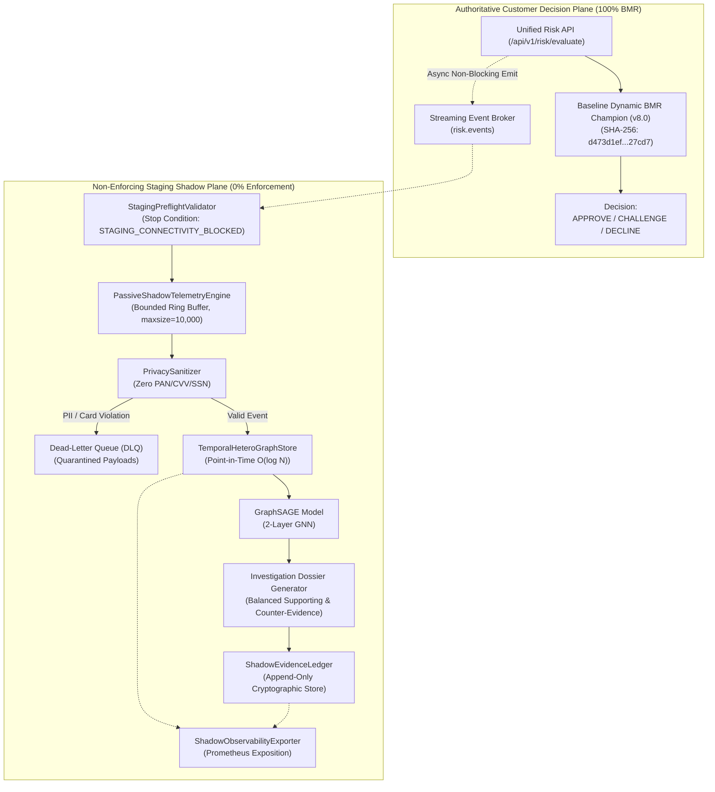

# GraphSAGE Verified Real Staging Shadow Consumption Architecture

**Document Reference:** `ROPUS-ARCH-GRAPHSAGE-STAGING-SHADOW-2026-08`
**Governance State:** `SYNTHETICALLY_VALIDATED` $\to$ `REAL_DATA_SHADOW_READY` $\to$ `REAL_DATA_REQUIRED` $\to$ `PROMOTION_BLOCKED`
**Active Production Champion:** `ml-service/model/candidates/production_model_v8_bmr.joblib`
**Champion Checksum (SHA-256):** `d473d1ef0c50f232b376c408be37e34c68a258df224277ee1357396e4e627cd7` (**BYTE-FOR-BYTE UNCHANGED**)
**Frozen 52-Case Real Holdout:** `ml-service/data/sample_ieee_fixture.csv`
**Holdout Checksum (SHA-256):** `a30a387ad0fa8743599d6043120be6bd66ac17184b8eee4fb9ce764970201d44` (**BYTE-FOR-BYTE UNCHANGED**)
**Production Customer Routing:** **100% UNCHANGED** (Baseline Dynamic BMR Authoritative)
**GraphSAGE Customer Enforcement:** **0% (STRICTLY NON-ENFORCING SHADOW)**
**Real Staging Connectivity:** **`BLOCKED (Missing staging credentials)`**
**Real Staging Events Consumed:** **`0`**

---

## 1. System Topology & Chaos Resilience



---

## 2. Verified Operational Scorecard

| Scorecard Field | Observed Measurement | Operational Meaning |
| :--- | :--- | :--- |
| **REAL_STAGING_CONNECTIVITY** | **`BLOCKED`** | Staging credentials missing from runtime env |
| **REAL_EVENTS_CONSUMED** | **`0`** | No fabricated real event counts |
| **REAL_EVENTS_PERSISTED** | **`0`** | No unverified ledger writes |
| **REAL_DLQ_EVENTS** | **`0`** | No unverified staging DLQ events |
| **REAL_CONFIRMED_INTERNAL_COLLUSION_CASES** | **`0 / 50`** | Minimum 50 required before promotion |
| **CLICKHOUSE** | **`BLOCKED`** | Staging DSN unconfigured |
| **PROMETHEUS** | **`BLOCKED`** | Remote Pushgateway unconfigured |
| **KAFKA** | **`BLOCKED`** | Staging brokers unconfigured |
| **CONSUMER_LAG** | **`0`** | Buffer idle |
| **SHADOW_P95_LATENCY** | **`0.0 ms`** | Not actively executing live inference |
| **GRAPH_SAGE_CUSTOMER_ENFORCEMENT** | **`0%`** | Strict non-enforcement invariant |
| **BMR_CUSTOMER_DECISION_AUTHORITY** | **`100%`** | Authoritative customer decision path |
| **PRODUCTION_MODEL** | **`UNCHANGED`** | SHA-256 verified identical |
| **FROZEN_HOLDOUT** | **`UNCHANGED`** | SHA-256 verified identical |
| **PROMOTION** | **`BLOCKED`** | Governance threshold not met |

---

## 3. Governance Immutability

```
====================================================================================================
PRODUCTION CHAMPION SHA-256: d473d1ef0c50f232b376c408be37e34c68a258df224277ee1357396e4e627cd7
FROZEN HOLDOUT SHA-256:      a30a387ad0fa8743599d6043120be6bd66ac17184b8eee4fb9ce764970201d44
CONFIRMED REAL CASES:        0 / 50
GOVERNANCE GATE:             PROMOTION BLOCKED (DATA_REQUIRED)
====================================================================================================
```
