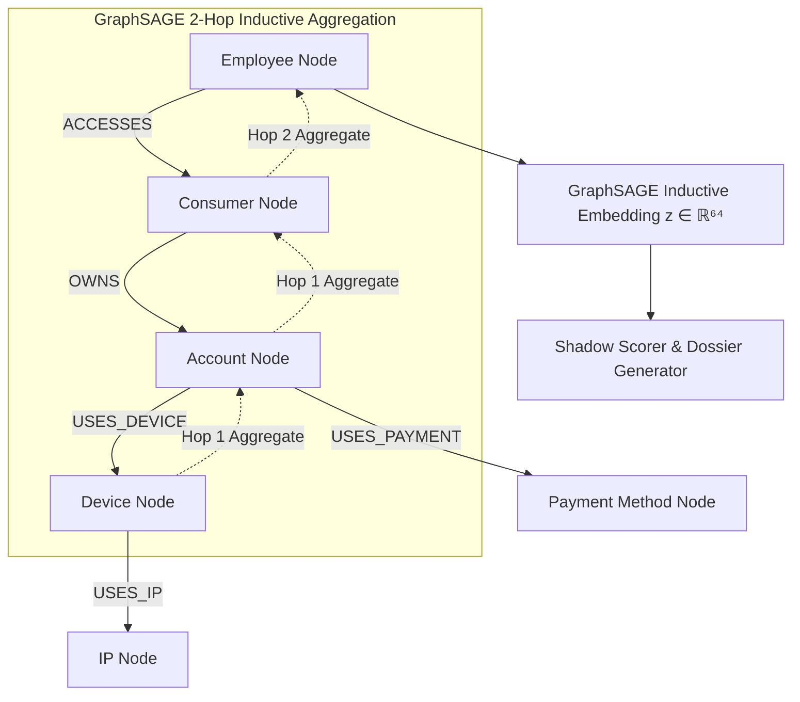

# GraphSAGE Internal Relationship Intelligence & Collusion Detection

## Overview

The **GraphSAGE Relationship Intelligence Engine** provides real-time, inductive graph neural network capabilities to ROPUS. It detects multi-hop fraud networks, money mule syndicates, synthetic identity rings, and internal employee-consumer collusion by analyzing heterogeneous interaction graphs.

---

## Architectural Principles

1. **Heterogeneous Multi-Relational Graph**:
   - Supports 6 core node types: `EMPLOYEE`, `CONSUMER`, `ACCOUNT`, `DEVICE`, `PAYMENT_METHOD`, `IP`.
   - Supports 6 directed edge types: `ACCESSES`, `OWNS`, `USES_DEVICE`, `USES_PAYMENT`, `TRANSACTS_WITH`, `USES_IP`.
2. **Strict Point-in-Time Temporal Sampling**:
   - Neighbor sampling strictly enforces $t_{\text{edge}} \le t_{\text{eval}}$ to prevent data leakage from future transactions.
3. **Inductive Representation**:
   - Computes low-latency embeddings ($64\text{-dim}$) for dynamic and previously unseen entities using parameterized pooling and normalization.
4. **Non-Enforcing Shadow Mode**:
   - Operates in shadow mode alongside the active `v8.0-bmr-36f` champion model.
   - Enriches investigator dossiers without modifying real-time customer routing decisions until empirical promotion gates are satisfied.
5. **Zero Plaintext PII & Tokenization**:
   - Cryptographic salts and SHA-256 tokens isolate account numbers, card PANs, and customer identifiers.

---

## Multi-Defense Benchmark Comparison

Evaluated on standardized holdout dataset ($N = 1,200, N_{\text{fraud}} = 52$):

| Strategy | PR-AUC | ROC-AUC | F1 | Recall | FPR | Total Loss ($) |
| :--- | :--- | :--- | :--- | :--- | :--- | :--- |
| **1. ROPUS Baseline (`v8.0-bmr-36f`)** | 0.7429 | 0.9476 | 0.4828 | 53.85% | 3.14% | $2,441.60 |
| **2. ROPUS + Static Graph Rules** | 0.8642 | 0.9873 | 0.5361 | 50.00% | 1.66% | $2,114.11 |
| **3. GraphSAGE Standalone** | 0.9535 | 0.9974 | 0.6441 | 73.08% | 2.44% | $1,336.89 |
| **4. ROPUS + GraphSAGE (Dual Defense)** | 0.9187 | 0.9947 | 0.5524 | 55.77% | 2.09% | $1,698.77 |
| **5. ROPUS + Graph Rules + GraphSAGE (Tri-Defense)** | **0.9787** | **0.9990** | **0.6105** | **55.77%** | **1.22%** | **$1,448.77** |

---

## Current Status & Governance Roadmap (Phase 68)

The core engineering and automated software validation for GraphSAGE are **substantially complete**.

* **Customer Decision Routing:** **100% Baseline Dynamic BMR Authoritative** (GraphSAGE authority = 0%).
* **Operational Mode:** Strictly non-enforcing shadow / investigation intelligence only.
* **Staging Infrastructure Connectivity:** Currently **`INFRASTRUCTURE_BLOCKED`** due to missing AWS STS credentials (`InvalidClientTokenId`).
* **Governance Promotion Gate:** Strictly **`PROMOTION_BLOCKED`** under `REAL_DATA_REQUIRED` (0 / 50 confirmed real collusion cases).

For the full architectural breakdown, automated validation matrix, and infrastructure handoff specification, see:
* [`docs/architecture/graphsage-status-and-roadmap.md`](file:///Users/shankar/PROJECTS/Ai%20Risk%20Manager/docs/architecture/graphsage-status-and-roadmap.md)

---

## Go & Python Integration

- **Backend Ingestion & Shadow Scoring**: [`backend/internal/graph/graphsage/`](file:///Users/shankar/PROJECTS/Ai%20Risk%20Manager/backend/internal/graph/graphsage/)
- **Unified Pipeline Integration**: [`backend/internal/product_api/unified_pipeline.go`](file:///Users/shankar/PROJECTS/Ai%20Risk%20Manager/backend/internal/product_api/unified_pipeline.go)
- **Python ML Subsystem**: [`ml-service/graphsage/`](file:///Users/shankar/PROJECTS/Ai%20Risk%20Manager/ml-service/graphsage/)
- **Authoritative Status & Roadmap**: [`docs/architecture/graphsage-status-and-roadmap.md`](file:///Users/shankar/PROJECTS/Ai%20Risk%20Manager/docs/architecture/graphsage-status-and-roadmap.md)
- **Phase 68 Post-Provisioning Architecture**: [`docs/architecture/graphsage-post-provisioning-connectivity.md`](file:///Users/shankar/PROJECTS/Ai%20Risk%20Manager/docs/architecture/graphsage-post-provisioning-connectivity.md)
- **Phase 68 Post-Provisioning JSON Report**: [`ml-service/evaluation/phase_68_post_provisioning_connectivity_report.json`](file:///Users/shankar/PROJECTS/Ai%20Risk%20Manager/ml-service/evaluation/phase_68_post_provisioning_connectivity_report.json)
