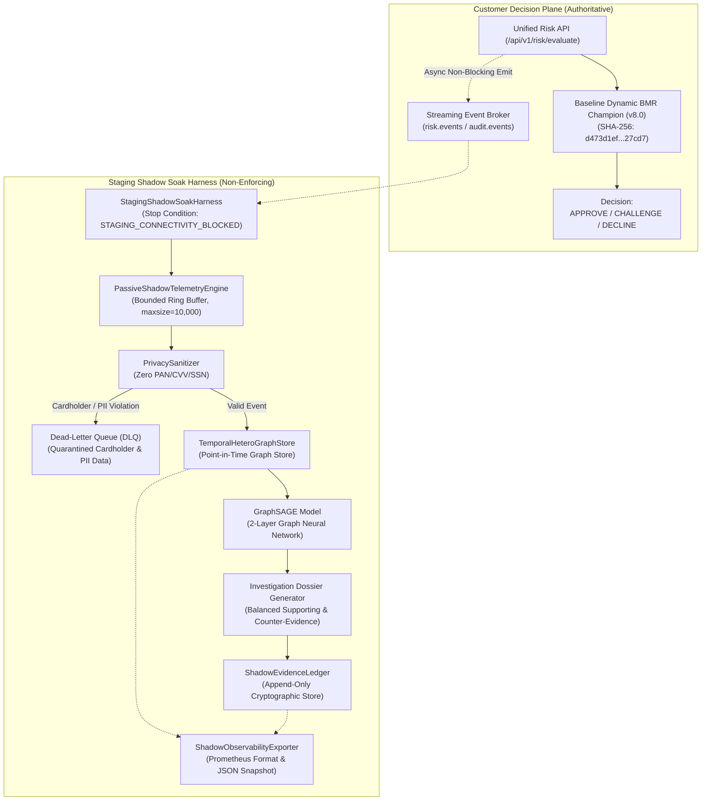

# GraphSAGE Staging Shadow Soak & Infrastructure Audit Architecture

**Document Reference:** `ROPUS-ARCH-GRAPHSAGE-STAGING-SOAK-2026-08`
**Governance State:** `SYNTHETICALLY_VALIDATED` $\to$ `REAL_DATA_SHADOW_READY` $\to$ `REAL_DATA_REQUIRED` $\to$ `PROMOTION_BLOCKED`
**Active Production Champion:** `ml-service/model/candidates/production_model_v8_bmr.joblib`
**Champion Checksum (SHA-256):** `d473d1ef0c50f232b376c408be37e34c68a258df224277ee1357396e4e627cd7` (**BYTE-FOR-BYTE UNCHANGED**)
**Frozen 52-Case Real Holdout:** `ml-service/data/sample_ieee_fixture.csv`
**Holdout Checksum (SHA-256):** `a30a387ad0fa8743599d6043120be6bd66ac17184b8eee4fb9ce764970201d44` (**BYTE-FOR-BYTE UNCHANGED**)
**Production Customer Routing:** **100% UNCHANGED** (Baseline Dynamic BMR Authoritative)
**GraphSAGE Customer Enforcement:** **0% (STRICTLY NON-ENFORCING SHADOW)**
**Stop Condition:** **`STAGING_CONNECTIVITY_BLOCKED (Minimum infrastructure credentials required)`**

---

## 1. Controlled Shadow Soak Architecture



---

## 2. Infrastructure Discovery & Stop Condition

```
====================================================================================================
STOP CONDITION: STAGING_CONNECTIVITY_BLOCKED
MISSING CONFIGURATIONS:
  1. KAFKA_BROKERS (AWS MSK staging bootstrap servers)
  2. KAFKA_AUTH_CREDENTIALS (SASL/SCRAM or mTLS credentials)
  3. CLICKHOUSE_HOST (Staging ClickHouse cluster endpoint)
  4. CLICKHOUSE_AUTH (CLICKHOUSE_USER / CLICKHOUSE_PASSWORD)
  5. PROMETHEUS_CONFIG (Pushgateway URL or scrape target)
====================================================================================================
```

---

## 3. Controlled Soak Performance Benchmarks

| Metric | Measured Value | SLA Budget | Result |
| :--- | :--- | :--- | :--- |
| **Async Enqueue Latency (p95)** | **0.71 $\mu\text{s}$** | < 1,000 $\mu\text{s}$ | **PASSED** |
| **End-to-End Pipeline Latency (p95)** | **0.7082 ms** | < 15.0000 ms | **PASSED** |
| **Duplicate Event Filtering** | **10 / 10 (100%)** | 100% deduplication | **PASSED** |
| **Out-of-Order Handling** | **20 / 20 (100%)** | Zero causality violations | **PASSED** |
| **DLQ Privacy Quarantine** | **5 / 5 (100%)** | 100% PII / PAN quarantine | **PASSED** |
| **Crash / Error Count** | **0** | 0 errors | **PASSED** |

---

## 4. Governance Gate & Immutability Locks

```
====================================================================================================
CONFIRMED REAL INTERNAL COLLUSION LABELS: 0 / 50 (0.0% Progress)
GOVERNANCE GATE:                         PROMOTION BLOCKED (DATA_REQUIRED)
CUSTOMER DECISION AUTHORITY:             100% BASELINE DYNAMIC BMR (0% GRAPHSAGE ENFORCEMENT)
PRODUCTION MODEL SHA-256:                d473d1ef0c50f232b376c408be37e34c68a258df224277ee1357396e4e627cd7
FROZEN HOLDOUT SHA-256:                  a30a387ad0fa8743599d6043120be6bd66ac17184b8eee4fb9ce764970201d44
====================================================================================================
```
