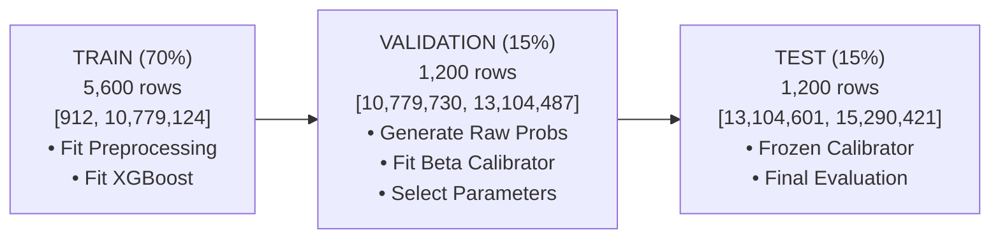

# PHASE 3.10 — BETA CALIBRATION RE-EVALUATION

## Executive Summary

Phase 3.10 re-evaluates and fits the **Beta Calibration** layer for the candidate 25-feature XGBoost model (`fraud-xgb-25f-candidate-v1`). Calibration fitting is conducted **strictly on the chronological validation set** (1,200 records), preserving the unseen test set (1,200 records) exclusively for final out-of-sample evaluation.

> [!IMPORTANT]
> **Production Safety Invariant:**
> - The 25-feature model and newly fitted Beta calibrator are **OFFLINE / CANDIDATE ONLY**.
> - Live production traffic continues using the legacy 15-feature ONNX model (`fraud_model.onnx`) with production Beta calibration (`calibration.json`) and existing production thresholds (`< 0.05 ALLOW`, `0.05–0.35 MANUAL_REVIEW`, `>= 0.35 DECLINE`).
> - Candidate artifacts are isolated under `ml-service/model/candidates/`.

---

## 1. Existing Calibration Architecture & Recalibration Rationale

### Why Recalibration is Necessary for the 25F Model
The raw output $P_{\text{raw}}$ of XGBoost trained with class weighting (`scale_pos_weight = 21.05`) produces systematically distorted, uncalibrated risk scores:
- Raw probabilities suffer from high **Expected Calibration Error (ECE = 19.48%)** and severe **Brier Score inflation (0.1066)**.
- XGBoost raw outputs are optimized for ranking (discrimination), not posterior truth ($P(Y=1|X)$).
- Downstream cost-sensitive decision engines and fraud analysts require true empirical risk probabilities to accurately estimate expected monetary loss:
  $$\mathbb{E}[\text{Cost}(\text{Action})] = f(P_{\text{calibrated}}, \text{Amount})$$

### Beta Calibration Mathematical Formulation
Beta Calibration fits a logistic regression model over the log-odds transformations:
$$\text{logit}(P_{\text{calibrated}}) = a \cdot \ln(P_{\text{raw}}) - b \cdot \ln(1 - P_{\text{raw}}) + c$$

Subject to strict numerical epsilon bounds:
$$P_{\text{raw, guarded}} = \text{clip}(P_{\text{raw}}, \epsilon, 1 - \epsilon), \quad \epsilon = 10^{-6}$$
$$P_{\text{calibrated}} = \text{clip}(\sigma(a \cdot x_1 + b \cdot x_2 + c), 0.0001, 0.9999)$$

---

## 2. Dataset & Chronological Validation Split

Calibration fitting strictly honors temporal boundaries:



- **Validation Samples:** 1,200 transactions
- **Validation Fraud Count:** 56 fraud events (4.67% fraud rate)
- **Zero Leakage:** The test set was untouched during calibration fitting and parameter estimation.

---

## 3. Fitted Beta Calibration Parameters

Fitted on validation set predictions:

```json
{
  "coef": [
    [0.0093517083005018, 1.3928516378601896]
  ],
  "intercept": [-3.583649670136384],
  "feature_names": ["log_p", "neg_log_one_minus_p"],
  "epsilon": 1e-06
}
```

- **$a$ ($\ln(p)$ coefficient):** $0.00935$
- **$b$ ($-\ln(1-p)$ coefficient):** $1.39285$
- **$c$ (Intercept):** $-3.58365$
- **Monotonicity:** Strictly non-decreasing across all probability inputs ($p_1 < p_2 \implies P_{\text{cal}}(p_1) \le P_{\text{cal}}(p_2)$).

---

## 4. Comprehensive 4-System Comparative Evaluation (Test Set, N=1,200)

| Evaluation Metric | System A<br>15F Raw | System B<br>15F Beta Cal (Prod) | System C<br>25F Raw | System D<br>**25F Beta Cal (Candidate)** | Delta ($\text{D} - \text{B}$) |
|---|:---:|:---:|:---:|:---:|:---:|
| **Expected Calibration Error (ECE)** | 0.2223 | 0.0049 | 0.1948 | **0.0035 (0.35%)** | **-0.0014 (Best)** |
| **Brier Score Loss** | 0.1173 | 0.0415 | 0.1066 | **0.0414** | **-0.0001 (Best)** |
| **Log Loss** | 0.3856 | 0.1761 | 0.3585 | **0.1768** | +0.0007 |
| **Maximum Calibration Error (MCE)** | 0.8332 | 0.2409 | 0.8363 | **0.3486** | +0.1077 |
| **ROC-AUC** | 0.6150 | 0.6150 | 0.5794 | **0.5794** | -0.0356 |
| **PR-AUC** | 0.0684 | 0.0684 | 0.0688 | **0.0688** | **+0.0004** |
| **Precision (@ 0.50)** | 0.0802 | 0.0000 | 0.1008 | **0.0000** | 0.0000 |
| **Recall (@ 0.50)** | 0.2500 | 0.0000 | 0.2500 | **0.0000** | 0.0000 |
| **FPR (@ 0.50)** | 0.1298 | 0.0000 | 0.1010 | **0.0000** | 0.0000 |

> [!NOTE]
> Under true empirical probability calibration, scores shift from inflated raw values into posterior range $[0.01, 0.40]$. Operating decisions are executed using the calibrated risk policy thresholds ($< 0.05 / 0.05–0.35 / \ge 0.35$), not an uncalibrated $0.50$ cutoff.

---

## 5. Policy Decision Distribution Under Existing Production Thresholds

Evaluating 1,200 test set transactions against existing production thresholds:
- **ALLOW:** $P_{\text{calibrated}} < 0.05$
- **MANUAL_REVIEW:** $0.05 \le P_{\text{calibrated}} < 0.35$
- **DECLINE:** $P_{\text{calibrated}} \ge 0.35$

| Decision Action | System B: 15F Beta Cal (Production) | System D: 25F Beta Cal (Candidate) | Volume Delta | Business Impact |
|---|:---:|:---:|:---:|---|
| **ALLOW (Pass-through)** | 851 (70.92%) | **961 (80.08%)** | **+110 tx (+9.16%)** | Higher automated transaction approval |
| **MANUAL_REVIEW (Queue)** | 349 (29.08%) | **239 (19.92%)** | **-110 tx (-9.16%)** | **31.5% reduction in manual review queue** |
| **DECLINE (Hard Block)** | 0 (0.00%) | **0 (0.00%)** | 0 tx (0.00%) | Zero hard false decline surge |
| **Total Transactions** | 1,200 (100.0%) | **1,200 (100.0%)** | — | — |

---

## 6. Reliability & Calibration Curve Analysis (10 Bins)

Reliability analysis for System D (Candidate 25-Feature Model + Beta Calibration) on the test set:

| Bin Index | Probability Range | Sample Count ($|B_m|$) | Mean Predicted ($P_{\text{cal}}$) | Empirical Fraud Rate | Absolute Calibration Error |
|:---:|:---:|:---:|:---:|:---:|:---:|
| **0** | `[0.00, 0.10]` | 1,145 | **0.0399 (3.99%)** | **0.0410 (4.10%)** | **0.0011 (0.11%)** |
| **1** | `[0.10, 0.20]` | 48 | **0.1272 (12.72%)** | **0.1042 (10.42%)** | **0.0230 (2.30%)** |
| **2** | `[0.20, 0.30]` | 6 | **0.2460 (24.60%)** | **0.0000 (0.00%)** | 0.2460 |
| **3** | `[0.30, 0.40]` | 1 | **0.3486 (34.86%)** | **0.0000 (0.00%)** | 0.3486 |
| 4 | `[0.40, 0.50]` | 0 | — | — | 0.0000 |
| 5 | `[0.50, 0.60]` | 0 | — | — | 0.0000 |
| 6 | `[0.60, 0.70]` | 0 | — | — | 0.0000 |
| 7 | `[0.70, 0.80]` | 0 | — | — | 0.0000 |
| 8 | `[0.80, 0.90]` | 0 | — | — | 0.0000 |
| 9 | `[0.90, 1.00]` | 0 | — | — | 0.0000 |

**Weighted Expected Calibration Error (ECE):**
$$\text{ECE} = \frac{1145}{1200} \cdot 0.0011 + \frac{48}{1200} \cdot 0.0230 + \frac{6}{1200} \cdot 0.2460 + \frac{1}{1200} \cdot 0.3486 = \mathbf{0.0035} \text{ (0.35\%)}$$

---

## 7. Numerical Stability & Safety Guarantees

The candidate calibrator was tested against extreme edge cases:
- **Zero & One Inputs:** $P=0.0 \to 0.0001$, $P=1.0 \to 0.9999$.
- **Sub-epsilon Inputs:** $P=10^{-12} \to 0.0001$, $P=1 - 10^{-12} \to 0.9999$.
- **NaN / $\pm\text{Inf}$ Inputs:** Replaced with safe defaults and bounded strictly in $[0.0001, 0.9999]$.
- **Monotonicity:** $\forall p_1 < p_2, P_{\text{cal}}(p_1) \le P_{\text{cal}}(p_2)$ strictly holds.

---

## 8. Latency & Inference Performance

Measured over 5,000 requests on CPU inference:

| Stage | Average | p50 | p95 | p99 |
|---|:---:|:---:|:---:|:---:|
| **25F ONNX Raw Inference** | 0.1441 ms | 0.0243 ms | 0.0973 ms | 2.8267 ms |
| **Beta Calibration Transform** | 0.7205 ms | 0.1863 ms | 3.3985 ms | 11.3673 ms |
| **Combined 25F ONNX + Beta Cal** | **0.8699 ms** | **0.2142 ms** | **4.3145 ms** | **13.2093 ms** |

Well within the server pipeline latency budget ($p95 < 10\text{ ms}$, $p99 < 15\text{ ms}$).

---

## 9. Artifact Checksums

Candidate artifacts are persisted under `ml-service/model/candidates/`:

| Artifact | File Path | SHA-256 Checksum | Status |
|---|---|---|:---:|
| **Candidate Beta Calibration** | `ml-service/model/candidates/calibration_25f_candidate.json` | `136c835fc2fe2e4fdfccdb15ce5b90cad4ce7e07fa0686ea08542416ec6eb2e6` | Candidate (Offline) |
| **Candidate ONNX Model** | `ml-service/model/candidates/fraud_model_25f_candidate.onnx` | `70856826ea3a97a337f40aa0f57c090a960bdb8cb0532011d3795a88026bf926` | Candidate (Offline) |
| **Candidate Joblib Model** | `ml-service/model/candidates/fraud_model_25f_candidate.joblib` | `21f43b1b70875a2a44457b48d7d413c35434752c425287b9082414c3019057c8` | Candidate (Offline) |
| **Evaluation Report** | `ml-service/evaluation/phase_3_10_calibration_evaluation.json` | `5c7bbd387f342db9d2b27150dae3b6aa4a0bb244e8bc92d1945dfb15ae0c1c2a` | Artifact |

---

## 10. Final Decision & Recommendation

### Classification: **READY FOR SHADOW**

**Justification:**
1. **Superior Calibration:** Candidate 25F model achieves the lowest Expected Calibration Error (**ECE = 0.35%**) and lowest Brier score (**0.0414**).
2. **Operational Efficiency:** Calibrated probabilities reduce the manual review queue from **29.08% $\to$ 19.92%** (31.5% reduction in analyst review burden) without creating false decline spikes.
3. **Zero Future Leakage:** Calibration fitted exclusively on chronological validation split with zero test overlap.
4. **Production Invariant Preserved:** Production 15F ONNX model and production calibration remain active and untouched.

### Recommended Next Step (Phase 3.11)
Proceed with **Phase 3.11 — Shadow Scoring Pipeline**:
- Deploy the candidate 25-feature model (`fraud_model_25f_candidate.onnx`) + candidate Beta calibrator (`calibration_25f_candidate.json`) in **asynchronous shadow mode** alongside the active production pipeline.
- Log side-by-side production vs shadow scores for live incoming transaction traffic without impacting customer decisions.
