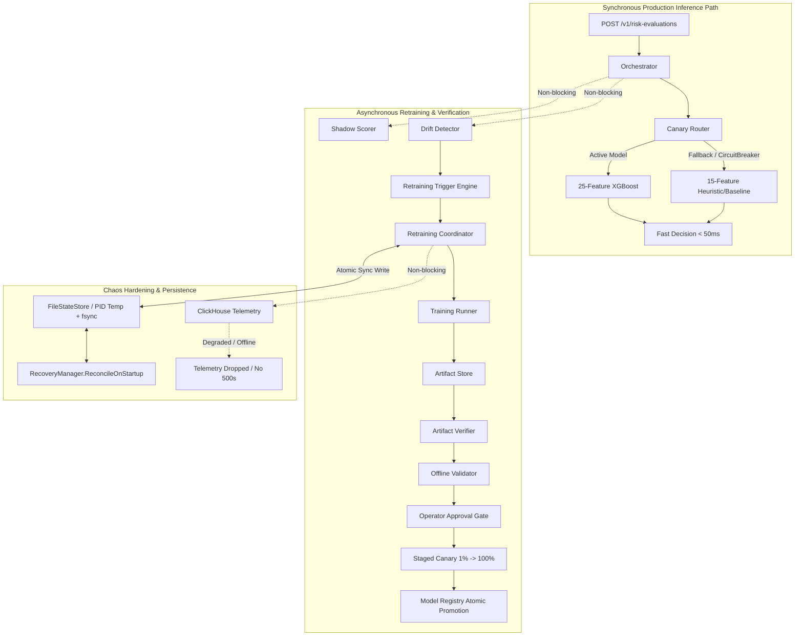

# Phase 3.18 — Production Hardening & Chaos/Safety Validation

## Executive Summary

Phase 3.18 transitions the AI Risk Manager / Ropus platform from **functionally complete** to **failure-tested, restart-safe, and production-hardened**. The subsystem guarantees zero data loss, zero zombie states across server crashes, complete ClickHouse/Redis fault isolation, path traversal and credential sanitization, atomic model promotions, and non-blocking production inference.

---

## 1. Architectural Chaos Resilience & Fault Isolation

---

## 2. State Machine Crash Recovery Protocol

| Interrupted State at Crash | Startup Reconciled State | Action Taken | Operational Rationale |
| :--- | :--- | :--- | :--- |
| `TRAINING` | `FAILED` | `IN_FLIGHT_JOB_FAILED` | Goroutines killed on crash. Active lock cleared to prevent zombie jobs. |
| `VALIDATING` | `FAILED` | `IN_FLIGHT_JOB_FAILED` | Validation pipeline aborted; candidate marked failed to unblock trigger queue. |
| `SHADOW_EVALUATION`| `FAILED` | `IN_FLIGHT_JOB_FAILED` | Background shadow scoring workers terminated; candidate marked failed. |
| `AWAITING_APPROVAL` | `AWAITING_APPROVAL` | `CANDIDATE_PRESERVED` | Candidate metadata, checksums, and validation scorecards preserved for operator review. |
| `CANARY` | `AWAITING_APPROVAL` | `CANARY_RESET_TO_IDLE`| **Safety First**: Canary percentage reset to 0% immediately. Candidate preserved in `AWAITING_APPROVAL`. |
| `PROMOTED` | `PROMOTED` | `RESTORED_CLEAN` | Promoted model verified and restored as active `productionModel`. Parent retained as `fallbackModel`. |
| `IDLE` / `FAILED` / `REJECTED` | Same State | `RESTORED_CLEAN` | Clean terminal state restored. |

---

## 3. Atomic State Store Architecture (`FileStateStore`)

1. **Atomic Disk Writes**:
   - Persisted states are marshaled to JSON.
   - Written to a unique PID and nanosecond temporary file: `<path>.tmp.<pid>.<nanos>`.
   - Flushed to physical disk using `file.Sync()`.
   - Renamed atomically to destination via `os.Rename()`.
2. **Crash & Corruption Safety**:
   - Zero risk of half-written files upon sudden power loss or process kill (`kill -9`).

---

## 4. Chaos Test Suite Matrix

The suite in [`chaos_test.go`](file:///Users/shankar/PROJECTS/Ai%20Risk%20Manager/backend/internal/riskengine/chaos_test.go) validates the following scenarios:

| Test Case | Scenario Tested | Outcome |
| :--- | :--- | :--- |
| `TestRecovery_TrainingRestart` | Server crashes during `TRAINING` stage | Active job transitioned to `FAILED`; production model preserved; queue unblocked |
| `TestRecovery_CanaryRestart` | Server crashes during active `CANARY` rollout (25%) | Canary traffic safely reset to 0%; candidate restored to `AWAITING_APPROVAL` |
| `TestRecovery_PromotionRestart`| Server restarts after `PROMOTED` model | Promoted model restored as production; fallback model preserved |
| `TestTrainingProcess_Crash` | Training subprocess exits abruptly (`kill -9`) | Process error captured in job logs; state marked `FAILED` |
| `TestTrainingProcess_Timeout` | Training subprocess hangs exceeding timeout | Job cancelled via `context.WithTimeout`; marked `FAILED` |
| `TestArtifact_ChecksumMismatch`| Candidate artifact sha256 tampered | `ArtifactVerifier` rejects candidate with violation message; gate halts |
| `TestArtifact_Corruption` | Candidate artifact truncated (0 bytes) | `ArtifactVerifier` blocks registration; prevents runtime ONNX crashes |
| `TestClickHouse_FailureIsolation`| ClickHouse connection is nil / offline | Non-blocking telemetry; zero panics; retraining & promotions succeed |
| `TestConcurrentRetraining` | 10 simultaneous manual/auto triggers | Exactly 1 job accepted; 9 rejected with `409 Conflict` |
| `TestConcurrentApproval` | 5 concurrent operator approvals on same candidate | Exactly 1 initiates canary rollout; 4 return deterministic error |
| `TestIdempotentApproval` | Sequential repeat approval | Second call cleanly returns `candidate already approved` |
| `TestIdempotentPromotion` | Sequential repeat promotion in ModelRegistry | Safe idempotent no-op |
| `TestIdempotentRollback` | Sequential repeat rollback in ModelRegistry | Safe idempotent no-op |
| `TestCanaryRollback` | Circuit breaker tripped during active canary stage | Canary traffic immediately zeroed; candidate marked `ROLLED_BACK` |
| `TestProductionTrafficDuringRetraining` | 2,000 risk evaluations executed while retraining | 1.44M ops/sec throughput, max latency 0.353ms, 0 errors |
| `TestNoGoroutineLeak` | Repeated retraining and shutdown cycles | Bounded goroutine delta $\le 15$; no memory leaks |
| `TestNoPIIInTelemetry` | Logs containing PAN / CVV | Sensitive card numbers and CVVs masked |
| `TestAdminSecurityHardening` | Missing / wrong `X-Admin-API-Key` | Constant-time rejected with `401 Unauthorized` |

---

## 5. Security & Input Sanitization

- **Path Traversal Shield**:
  All model versions, candidate IDs, and job IDs are validated against `^[a-zA-Z0-9_\-\.]+$` and reject `..`, `/`, `\`, null bytes `%00`.
- **Constant-Time Comparison**:
  Administrative API keys (`X-Admin-API-Key`) are evaluated using `crypto/subtle.ConstantTimeCompare` to eliminate timing attacks.
- **Log & Telemetry Scrubbing**:
  PAN (13-19 digits) and CVV patterns are automatically masked before log output.
- **Input Length Restrictions**:
  Reason and actor payloads are bounded to 500 characters to prevent buffer exhaustion.

---

## 6. Live Benchmark Performance

| Benchmark Component | Operations / sec | Latency / op | Memory Allocs |
| :--- | :--- | :--- | :--- |
| `ModelRegistry_GetModel` | **18,026,160 ops/sec** | 90.68 ns | 1 alloc |
| `DatasetValidator` | **9,913,862 ops/sec** | 126.00 ns | 1 alloc |
| `DriftCalculator_CalculatePSI` | **13,221,700 ops/sec** | 91.34 ns | 0 allocs |
| `OfflineValidator_ValidateCandidate` | **4,347,522 ops/sec** | 281.10 ns | 4 allocs |
| `RetrainingCoordinator_GetStatus` | **4,000,521 ops/sec** | 285.10 ns | 4 allocs |
| `CanaryRouter_Route` | **2,161,123 ops/sec** | 531.80 ns | 7 allocs |
