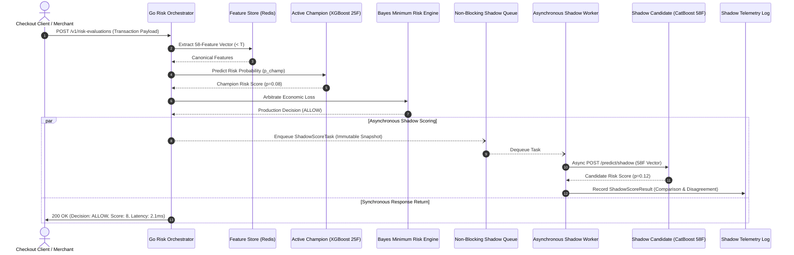

# ROPUS Platform — Shadow-Mode Architecture Specification

## 1. System Overview & Governance Mandate

To ensure zero production risk, eliminate lookahead bias, and test candidate model generalizability under real traffic, ROPUS enforces an asynchronous **Zero-Authority Shadow Evaluation Architecture**.

- **Production Champion**: `fraud-xgb-25f-v3.0` (100% Customer Decision Authority)
- **Active Shadow Candidate**: `extended_catboost_58f` (0% Customer Decision Authority)
- **Mathematical Isolation**: The candidate model cannot alter risk scores, change BMR action recommendations, or delay checkout responses under any failure scenario.

---

## 2. End-to-End Sequence & Component Topology



---

## 3. Strict Decision Isolation Invariants

| Invariant ID | Name | Architectural Guarantee | Verification Test |
| :---: | :--- | :--- | :--- |
| **INV-SHADOW-01** | **Zero Decision Authority** | The candidate model output is never passed to BMR arbitration, rules engine, or customer response serializers. | [`TestShadowCandidateZeroDecisionAuthority`](file:///Users/shankar/PROJECTS/Ai%20Risk%20Manager/backend/internal/riskengine/shadow_isolation_test.go#L16) |
| **INV-SHADOW-02** | **Non-Blocking Resilience** | Candidate service failures, HTTP 500s, or network timeouts are handled asynchronously without impacting synchronous checkout flow. | [`TestShadowFailureNeverBlocksChampion`](file:///Users/shankar/PROJECTS/Ai%20Risk%20Manager/backend/internal/riskengine/shadow_isolation_test.go#L69) |
| **INV-SHADOW-03** | **Immutable State Snapshots** | Feature vectors and model predictions are captured at decision time; retrospective chargebacks cannot mutate decision-time features. | [`test_shadow_telemetry_immutability`](file:///Users/shankar/PROJECTS/Ai%20Risk%20Manager/ml-service/tests/test_shadow_outcome_attribution.py#L18) |
| **INV-SHADOW-04** | **Dual-Control Governance** | Promoting a shadow model to production requires explicit maker-checker signoff; self-approval and unpassed evaluations are rejected. | [`TestShadowCannotBypassMakerChecker`](file:///Users/shankar/PROJECTS/Ai%20Risk%20Manager/backend/internal/riskengine/shadow_isolation_test.go#L122) |

---

## 4. Telemetry Schema & Storage

Every shadow evaluation records a zero-PII structured record:
```json
{
  "evaluation_id": "dec_faa82c1b-fa85-4022-9208-01b54081ab81",
  "tenant_id": "tenant_prod_us",
  "timestamp": "2026-08-27T04:13:35Z",
  "champion_model_version": "fraud-xgb-25f-v3.0",
  "candidate_model_version": "extended_catboost_58f",
  "champion_probability": 0.0800,
  "candidate_raw_probability": 0.1200,
  "candidate_calibrated_probability": 0.0910,
  "champion_action": "ALLOW",
  "candidate_action": "ALLOW",
  "action_disagreement": false,
  "score_delta": +0.0110,
  "inference_latency_ms": 0.275,
  "fallback_status": "NORMAL"
}
```
