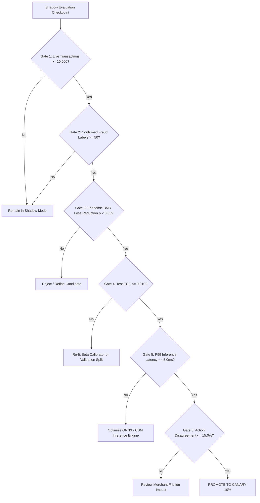

# ROPUS Platform — Shadow-Mode Statistical Evaluation Protocol

## 1. Objective & Methodological Safeguards

This protocol defines the statistical procedure for evaluating the **Extended CatBoost Candidate (`extended_catboost_58f`)** against the **Production Champion (`fraud-xgb-25f-v3.0`)** on live shadow traffic.

### Invariant Rules
1. **Zero Continuous Peeking**: Evaluation is performed in discrete evaluation checkpoints (e.g. at $N=2,500, 5,000, 7,500, 10,000$) using alpha-spending functions to avoid multiple-testing false discoveries.
2. **Delayed Label Handling**: Chargeback labels typically arrive 30–60 days after transaction authorization. Only cohort events whose observation window has matured ($> 60\text{ days}$) are included in ground-truth metrics.
3. **Paired Bootstrap Resampling**: Significance tests must be paired on identical transaction events to preserve covariance.

---

## 2. Evaluation Dimensions

### A. Ranking Quality
- **ROC-AUC**: Area under the Receiver Operating Characteristic curve.
- **PR-AUC**: Area under the Precision-Recall curve (Primary ranking metric for class imbalance).

### B. Decision Quality
- **Optimal Operational Threshold ($\tau^* = 0.170$)**: Precision, Recall, F1 Score, False Positive Rate (FPR), and Fraud Capture Rate.
- **Action Disagreement Rate**: Percentage of transactions where candidate hypothetical action differs from champion action.

### C. Calibration Quality
- **Brier Score**: Mean squared error between calibrated probability and binary outcome.
- **Expected Calibration Error (ECE)**: Weighted calibration gap across 10 probability bins. Target: $\text{ECE} \le 0.010$.

### D. Economic BMR Monetary Loss
- **Expected Loss ($L$)**: Total business monetary loss under the Bayes Minimum Risk cost matrix across transaction amounts.
- **Superiority Hypothesis**: $H_0: L_{\text{cand}} \ge L_{\text{champ}}$ vs $H_1: L_{\text{cand}} < L_{\text{champ}}$ with $\alpha = 0.05$.

---

## 3. The Six Empirical Promotion Gates

